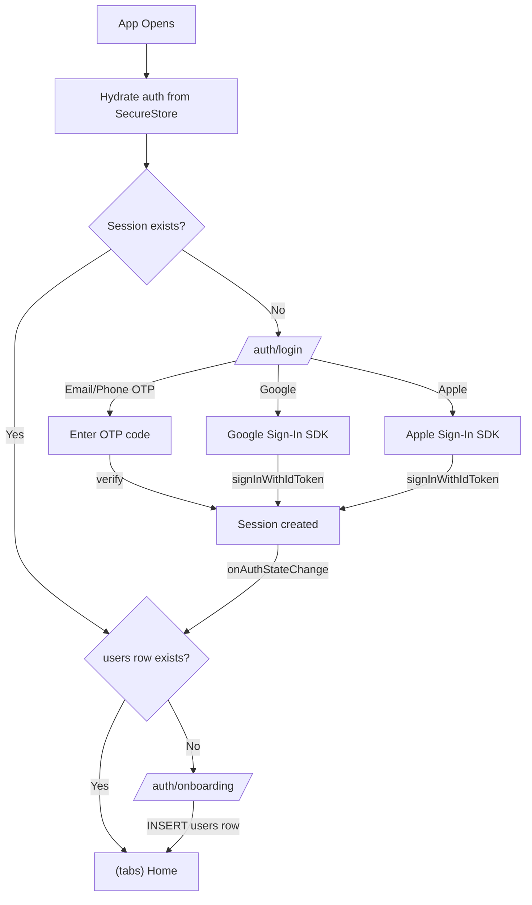

# Authentication Flow Implementation

## Architecture Overview



## Dependencies to Install

- `@react-native-google-signin/google-signin` -- native Google Sign-In (config plugin for Expo prebuild)
- `expo-apple-authentication` -- native Apple Sign-In (Expo module, no extra config)

Both use `supabase.auth.signInWithIdToken()` for native token exchange, avoiding web browser redirects.

**Not needed**: `expo-auth-session` (web-based OAuth is inferior UX for native apps).

## 1. Auth Store Expansion -- `src/store/authStore.ts`

Expand the existing Zustand store to track session, profile, and onboarding state:

```typescript
interface AuthState {
  session: Session | null;
  profile: User | null;       // from public.users table
  hydrated: boolean;          // SecureStore session loaded
  isLoading: boolean;         // auth operation in progress
  setSession: (session: Session | null) => void;
  setProfile: (profile: User | null) => void;
  setHydrated: (hydrated: boolean) => void;
  setLoading: (loading: boolean) => void;
  reset: () => void;          // sign-out cleanup
}
```

Derived state (computed in hook, not stored):
- `isAuthenticated` = `session !== null`
- `isOnboarded` = `profile !== null`

## 2. Auth Hook -- `src/hooks/useAuth.ts`

The central auth orchestrator. Responsibilities:

- **`initAuth()`**: Called once from root layout on mount. Sets `hydrated: false`, calls `supabase.auth.getSession()`, then subscribes to `onAuthStateChange`. On session, fetch profile from `users` table. Sets `hydrated: true` when done.

- **`signInWithEmailOtp(email)`**: Calls `supabase.auth.signInWithOtp({ email })`. Returns success/error.

- **`signInWithPhoneOtp(phone)`**: Calls `supabase.auth.signInWithOtp({ phone })`. Returns success/error.

- **`verifyOtp(tokenHash, type)`**: Calls `supabase.auth.verifyOtp()`. Session created automatically via `onAuthStateChange`.

- **`signInWithGoogle()`**: Uses `@react-native-google-signin/google-signin` to get `idToken`, then `supabase.auth.signInWithIdToken({ provider: 'google', token: idToken })`.

- **`signInWithApple()`**: Uses `expo-apple-authentication` to get `identityToken`, then `supabase.auth.signInWithIdToken({ provider: 'apple', token: identityToken })`.

- **`completeOnboarding(data)`**: `INSERT` into `users` table via Supabase client (RLS policy `id = auth.uid()` covers this). Sets profile in store.

- **`signOut()`**: `supabase.auth.signOut()`, reset store, navigate to login.

- **`fetchProfile(userId)`**: `supabase.from('users').select('*').eq('id', userId).single()`. Returns `User | null`.

**Important**: `onAuthStateChange` handles ALL navigation triggers. Login/OAuth screens do NOT navigate directly -- they perform the auth action and the root layout reacts to state changes.

## 3. Root Layout Auth Guard -- `app/_layout.tsx`

Update the existing auth guard to handle three states:

```typescript
const { session, profile, hydrated } = useAuthStore();
const isOnboarded = profile !== null;

useEffect(() => {
  if (!isReady) return;
  
  if (!session && !isAuthRoute) {
    router.replace('/auth/login');
  } else if (session && !isOnboarded && segments[0] !== 'auth') {
    router.replace('/auth/onboarding');
  } else if (session && isOnboarded && isAuthRoute) {
    router.replace('/(tabs)');
  }
}, [isReady, session, isOnboarded, isAuthRoute]);
```

Also change auth screen registration from `presentation: 'modal'` to default (fullscreen):

```typescript
<Stack.Screen name="auth/login" />
<Stack.Screen name="auth/onboarding" />
```

Call `initAuth()` from root layout on mount (before `SplashScreen.hideAsync`).

## 4. Login Screen -- `app/auth/login.tsx`

### Layout

```
+-----------------------------------------+
|                                         |
|            [Masjidy Logo]               |  <-- Minaret SVG or text logo
|         Your Local Mosque App           |
|                                         |
+-----------------------------------------+
|                                         |
|  [    Email address     ]               |  <-- Input component
|  [  Continue with Email ]               |  <-- Primary button
|                                         |
|  -------- or --------                   |
|                                         |
|  [ +88  Phone number    ]               |  <-- Input with country code
|  [  Continue with Phone ]               |  <-- Primary button
|                                         |
|  -------- or --------                   |
|                                         |
|  [G  Continue with Google  ]            |  <-- Secondary button
|  [   Continue with Apple   ]            |  <-- Secondary button (iOS only)
|                                         |
+-----------------------------------------+
```

### State Machine

The screen has two sub-views controlled by a `step` state:
- `'input'` -- show email/phone inputs and social buttons
- `'verify'` -- show OTP code input (6 digits) with countdown timer and resend button

When user taps "Continue with Email/Phone":
1. Set loading on that button
2. Call `signInWithEmailOtp` or `signInWithPhoneOtp`
3. On success, transition to `step: 'verify'`
4. On error, show error message via inline text (not toast)

OTP verification view:
- 6-digit input (auto-focus, numeric keyboard)
- "Resend code" with 60-second cooldown timer
- "Back" to return to input step
- Auto-submit when 6 digits entered

### Key Decisions

- **Country code picker for phone**: Simple picker with a curated list (Bangladesh +880, India +91, Saudi Arabia +966, UAE +971, UK +44, US +1, Pakistan +92). Not a full library -- a `Pressable` that opens a small modal with `FlatList`. Store selection in component state.
- **Apple Sign-In**: Only render on iOS (use `Platform.OS === 'ios'`).
- **Error messages**: Map Supabase error codes to i18n keys. Never show raw errors.
- **Keyboard avoidance**: Wrap in `KeyboardAvoidingView` or use `ScreenContainer` if it handles this.

### Dependencies on existing components

- `Button` from [`src/components/ui/Button.tsx`](src/components/ui/Button.tsx) -- primary/secondary variants, loading state
- `Input` from [`src/components/ui/Input.tsx`](src/components/ui/Input.tsx) -- with left icon slot for country code

## 5. Onboarding Screen -- `app/auth/onboarding.tsx`

### Layout

```
+-----------------------------------------+
|                                         |
|     Welcome to Masjidy!                 |  <-- title-lg
|     Set up your profile                 |  <-- body-md, text-secondary
|                                         |
|  Display Name *                         |
|  [    Your name          ]              |
|                                         |
|  Language                               |
|  [ English            v ]              |  <-- Picker/Select
|                                         |
|  Prayer Calculation Method              |
|  [ Karachi (default)  v ]              |  <-- Picker/Select, default: karachi
|                                         |
|                                         |
|  [    Get Started        ]              |  <-- Primary button, full width
|                                         |
+-----------------------------------------+
```

### Implementation Notes

- **Default prayer_calc_method**: `karachi` (Dhaka pilot city).
- **Language options**: `en` (English), `ar` (Arabic), `bn` (Bengali), `ur` (Urdu). Use `as const` map from types.
- **Prayer calc options**: `mwl` (MWL), `isna` (ISNA), `karachi` (Karachi), `umm_al_qura` (Umm Al-Qura). Already defined in [`src/types/user.ts`](src/types/user.ts).
- **Validation**: `display_name` required, min 2 chars, max 50 chars. Other fields have defaults.
- **Submit**: Direct Supabase client insert into `users` table. RLS policy `users_own` with `USING (id = auth.uid())` covers INSERT (Postgres uses USING as WITH CHECK when WITH CHECK is absent).

```typescript
const { error } = await supabase.from('users').insert({
  id: session.user.id,
  display_name: name.trim(),
  language: selectedLanguage,
  prayer_calc_method: selectedMethod,
});
```

- On success: set profile in authStore, root layout guard auto-navigates to `(tabs)`.
- On error: show user-friendly message.

### Select/Picker Component

Gluestack UI `select` is not yet installed. Options:
1. Run `npx gluestack-ui add select` to add the Gluestack Select primitive
2. Build a simple picker using `Pressable` + `Modal` + `FlatList`

**Recommendation**: Use Gluestack Select (`npx gluestack-ui add select`) for consistency with the component library. Wrap it in `src/components/ui/Select.tsx` matching the Input styling pattern.

## 6. i18n Strings

Add auth-related keys to all locale files. Example for [`src/i18n/en.json`](src/i18n/en.json):

```json
{
  "auth.login.title": "Welcome to Masjidy",
  "auth.login.subtitle": "Your connection to your local mosque",
  "auth.login.email.label": "Email address",
  "auth.login.email.placeholder": "you@example.com",
  "auth.login.email.button": "Continue with Email",
  "auth.login.phone.label": "Phone number",
  "auth.login.phone.placeholder": "01XXXXXXXXX",
  "auth.login.phone.button": "Continue with Phone",
  "auth.login.google": "Continue with Google",
  "auth.login.apple": "Continue with Apple",
  "auth.login.divider": "or",
  "auth.otp.title": "Enter verification code",
  "auth.otp.subtitle": "We sent a code to {{destination}}",
  "auth.otp.resend": "Resend code",
  "auth.otp.resendIn": "Resend in {{seconds}}s",
  "auth.otp.back": "Use a different method",
  "auth.onboarding.title": "Welcome to Masjidy!",
  "auth.onboarding.subtitle": "Set up your profile",
  "auth.onboarding.name.label": "Display Name",
  "auth.onboarding.name.placeholder": "Your name",
  "auth.onboarding.language.label": "Language",
  "auth.onboarding.calcMethod.label": "Prayer Calculation Method",
  "auth.onboarding.submit": "Get Started",
  "auth.error.invalidEmail": "Please enter a valid email address",
  "auth.error.invalidPhone": "Please enter a valid phone number",
  "auth.error.otpFailed": "Invalid code. Please try again.",
  "auth.error.rateLimited": "Too many attempts. Please wait a moment.",
  "auth.error.generic": "Something went wrong. Please try again.",
  "auth.error.nameRequired": "Display name is required",
  "auth.error.nameTooShort": "Name must be at least 2 characters",
  "auth.signOut": "Sign Out"
}
```

## 7. External Configuration Prerequisites

These are **not code changes** but required for auth methods to work:

- **Supabase Dashboard**: Enable Email OTP, Phone OTP (requires Twilio), Google OAuth, Apple OAuth providers
- **Google Cloud Console**: Create OAuth 2.0 client IDs (web + iOS + Android). Add web client ID to Supabase Google provider config. Add iOS/Android client IDs to `@react-native-google-signin` config plugin in `app.json`.
- **Apple Developer**: Enable "Sign in with Apple" capability (already noted in `app.json` with `usesAppleSignIn: true`). Configure Apple provider in Supabase dashboard.
- **Twilio**: Configure in Supabase dashboard for Phone OTP (or use Supabase's built-in free tier for testing)

## 8. app.json Plugin Updates

```json
{
  "plugins": [
    // ... existing plugins ...
    "@react-native-google-signin/google-signin",
    "expo-apple-authentication"
  ],
  "ios": {
    "usesAppleSignIn": true  // already present
  }
}
```

## File Change Summary

| File | Action | Description |
|---|---|---|
| `package.json` | Modify | Add `@react-native-google-signin/google-signin`, `expo-apple-authentication` |
| `app.json` | Modify | Add config plugins for Google Sign-In |
| `src/store/authStore.ts` | Rewrite | Add `profile`, `isLoading`, `reset`, remove `hydrated: true` default |
| `src/hooks/useAuth.ts` | Rewrite | Full auth hook with all methods |
| `app/_layout.tsx` | Modify | Add `initAuth`, expand auth guard for onboarding, change auth screen presentation |
| `app/auth/login.tsx` | Rewrite | Full login screen with 4 auth methods + OTP verification |
| `app/auth/onboarding.tsx` | Rewrite | Onboarding form with name, language, calc method pickers |
| `src/i18n/en.json` | Modify | Add auth string keys |
| `src/i18n/ar.json` | Modify | Add auth string keys (Arabic) |
| `src/i18n/bn.json` | Modify | Add auth string keys (Bengali) |
| `src/i18n/ur.json` | Modify | Add auth string keys (Urdu) |
| `src/components/ui/Select.tsx` | Create | Select wrapper (if Gluestack Select is added) |
