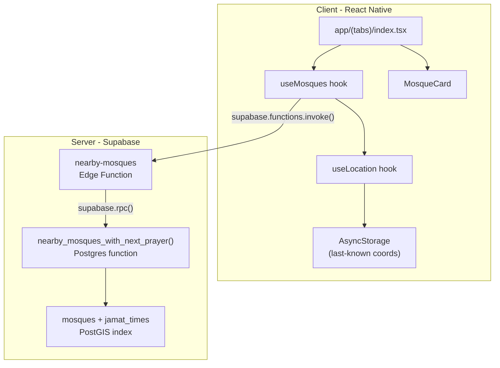
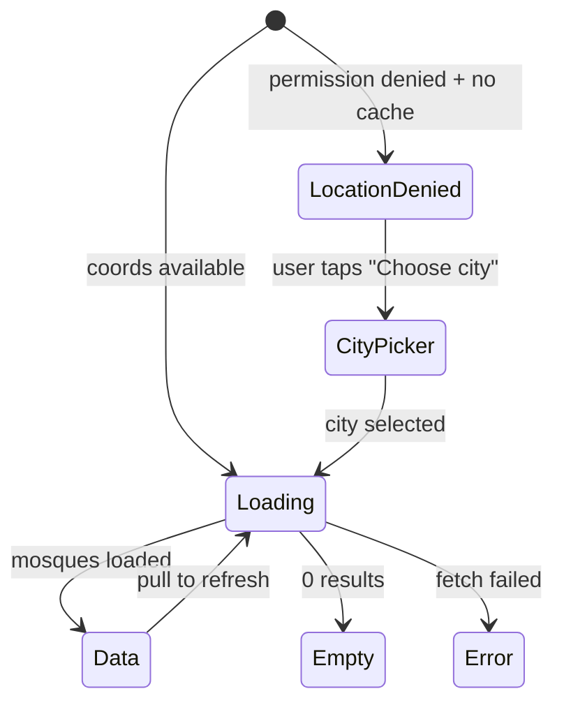

# FR-002: Mosque Discovery Implementation Plan

## Current State

All target files exist as empty stubs. The foundation is solid:
- Supabase client initialized ([src/services/supabase.ts](src/services/supabase.ts))
- Domain types defined ([src/types/mosque.ts](src/types/mosque.ts)) -- `Mosque`, `JamatTime`, `MosqueFacilities`, `PrayerType`
- Database types generated ([src/types/database.ts](src/types/database.ts)) with PostGIS functions
- Preferences store with `locationGranted` flag ([src/store/preferencesStore.ts](src/store/preferencesStore.ts))
- UI primitives implemented: `Skeleton`, `Card`, `Input`, `ScreenContainer`
- i18n set up with en/ar/bn/ur
- Constants: `PRAYER_ORDER`, `FACILITY_KEYS`

## Architecture



## Dependency Layer (implement first)

### D1. SQL Migration -- Postgres function `nearby_mosques_with_next_prayer`

**File:** `supabase/migrations/005_nearby_mosques_function.sql`

PostgREST cannot express PostGIS queries, so we create a Postgres function callable via `.rpc()`.

```sql
CREATE OR REPLACE FUNCTION nearby_mosques_with_next_prayer(
  p_lat DOUBLE PRECISION,
  p_lng DOUBLE PRECISION,
  p_radius_km INT DEFAULT 10,
  p_limit INT DEFAULT 20,
  p_current_local_time TIME DEFAULT LOCALTIME
)
RETURNS TABLE (
  id UUID,
  name TEXT,
  distance_km DOUBLE PRECISION,
  next_prayer prayer_type,
  next_jamat_time TIMETZ,
  next_trust_score INT,
  facilities JSONB,
  is_tomorrow BOOLEAN
) ...
```

Key logic:
- `ST_DWithin(m.location, ST_Point(p_lng, p_lat)::geography, p_radius_km * 1000)` for filtering
- `ST_Distance(...) / 1000.0` for `distance_km`
- LATERAL join on `jamat_times WHERE status='live'`
- **Timezone-safe comparison**: compare `jt.time::time` (cast TIMETZ to plain TIME, stripping offset) against `p_current_local_time`. Within a 10-50km radius, all mosques share the user's timezone, so plain TIME comparison is correct. The Edge Function derives the user's current local time and passes it explicitly -- never rely on DB `CURRENT_TIME` which is server-timezone.
- First try `jt.time::time > p_current_local_time` (today's next prayer). If null, wrap to the earliest prayer (Fajr tomorrow) and set `is_tomorrow = TRUE`
- ORDER BY `distance_km`, LIMIT `p_limit`
- Security: Uses `SECURITY INVOKER` (the default) -- no DEFINER needed. RLS on `mosques` is `SELECT USING (true)` and on `jamat_times` is `SELECT USING (status = 'live')`, so the anon role can already read everything this function needs.

### D2. Response type -- `NearbyMosque`

**File:** [src/types/mosque.ts](src/types/mosque.ts) -- add interface

```typescript
export interface NearbyMosque {
  id: string;
  name: string;
  distance_km: number;
  next_prayer: PrayerType | null;
  next_jamat_time: string | null;
  next_trust_score: number | null;
  facilities: MosqueFacilities;
  is_tomorrow: boolean;
}
```

### D3. Config constants

**File:** [src/constants/config.ts](src/constants/config.ts) -- replace stub

- `NEARBY_MOSQUES_DEFAULT_RADIUS_KM = 10`
- `NEARBY_MOSQUES_DEFAULT_LIMIT = 20`
- `LOCATION_STORAGE_KEY = 'masjidy-last-location'`
- `CITY_PRESETS` array: Dhaka, London, New York, Riyadh, Dubai, Karachi, Istanbul, Kuala Lumpur (each with `{ label, lat, lng }`)

### D4. Formatters

**File:** [src/lib/formatters.ts](src/lib/formatters.ts) -- replace stub

- `formatDistance(km: number): string` -- "400 m" if <1km, "1.2 km" otherwise
- `formatJamatTime(timetz: string): string` -- parse TIMETZ string to localized "4:30 PM" / "16:30"
- `formatPrayerLabel(prayer: PrayerType): string` -- returns i18n key lookup (e.g. `t('prayer.asr')`)

### D5. API service

**File:** [src/services/api.ts](src/services/api.ts) -- replace stub

Single function for this feature:
```typescript
export async function fetchNearbyMosques(params: {
  lat: number;
  lng: number;
  radiusKm?: number;
  limit?: number;
}): Promise<NearbyMosque[]>
```
Uses `supabase.functions.invoke('nearby-mosques', { body: ... })`. Automatically includes `tz_offset_min` derived from `new Date().getTimezoneOffset()` (negated, since JS returns minutes behind UTC while we want minutes ahead). Throws typed error on failure. No JWT required (the Supabase client attaches it automatically if the user is authenticated; the Edge Function treats it as optional).

### D6. i18n strings

**File:** [src/i18n/en.json](src/i18n/en.json) -- add keys

- `mosques.list.nearYou` -- "Near You"
- `mosques.list.count` -- "{{count}} mosques found"
- `mosques.list.searchPlaceholder` -- "Search mosques..."
- `mosques.list.empty.title` -- "No mosques found"
- `mosques.list.empty.subtitle` -- "Try expanding your search radius or check your location settings"
- `mosques.list.empty.cta` -- "Search by city instead"
- `mosques.list.locationDenied.title` -- "Location access needed"
- `mosques.list.locationDenied.subtitle` -- "Enable location or pick a city to discover nearby mosques"
- `mosques.list.cityPicker.title` -- "Choose a city"
- `mosques.list.tomorrow` -- "Tomorrow"
- `prayer.fajr` through `prayer.jumuah`
- `mosques.card.distance` -- "{{distance}} away"

---

## Deliverable 1: `useLocation` hook

**File:** [src/hooks/useLocation.ts](src/hooks/useLocation.ts)

### Interface

```typescript
interface LocationState {
  coords: { latitude: number; longitude: number } | null;
  loading: boolean;
  error: string | null;
  permissionStatus: 'undetermined' | 'granted' | 'denied';
  requestPermission: () => Promise<void>;
  refresh: () => Promise<void>;
}
```

### Implementation details

1. On mount: check `expo-location` permission status via `Location.getForegroundPermissionsAsync()`
2. If granted: call `Location.getCurrentPositionAsync({ accuracy: Location.Accuracy.Balanced })`, store result in state, persist to AsyncStorage under `LOCATION_STORAGE_KEY`
3. If undetermined: expose `requestPermission()` which calls `Location.requestForegroundPermissionsAsync()`, then fetches location if granted
4. If denied: read last-known coords from AsyncStorage as fallback. If no cached coords, `coords` stays `null` and `permissionStatus` is `'denied'`
5. `refresh()`: re-fetches current GPS (for pull-to-refresh)
6. Update `preferencesStore.setLocationGranted()` when permission changes
7. Timeouts: 10s for GPS fix. On timeout, fall back to `Location.getLastKnownPositionAsync()`

### Error cases
- Permission denied + no cached coords -> screen shows city picker
- GPS timeout -> use last known position
- Location services disabled -> same as denied

---

## Deliverable 2: `nearby-mosques` Edge Function

**File:** `supabase/functions/nearby-mosques/index.ts` (new directory + file)

### Request/Response contract (per PROJECT_SPEC 7.2)

```
GET /functions/v1/nearby-mosques?lat=23.81&lng=90.41&radius_km=10&limit=20
Authorization: Optional Bearer <jwt>

200: { "mosques": NearbyMosque[] }
400: { "error": "INVALID_PARAMS", "message": "..." }
```

### Implementation (follows [edge-functions.mdc](.cursor/rules/edge-functions.mdc))

```
Deno.serve(async (req) => {
  // 1. CORS preflight
  // 2. Parse query params from URL (GET request)
  // 3. Validate: lat [-90,90], lng [-180,180], radius_km [1,50], limit [1,50]
  // 4. Optional JWT: extract user but don't reject anonymous
  // 5. Compute user's current local time: derive from client-sent
  //    timezone offset param (tz_offset_min) or default to UTC.
  //    Format as HH:MM:SS for the SQL function's TIME parameter.
  // 6. Create Supabase client with ANON key (not service role).
  //    Pass through Authorization header if present so the client
  //    executes under the caller's RLS context. The Postgres function
  //    uses SECURITY INVOKER; anon role can read mosques + live jamat_times.
  // 7. Call supabase.rpc('nearby_mosques_with_next_prayer',
  //    { p_lat, p_lng, p_radius_km, p_limit, p_current_local_time })
  // 8. Shape response: map rows to NearbyMosque JSON
  // 9. Return with CORS headers
});
```

Key decisions:
- Uses **anon client** (not service role) -- the Postgres function is SECURITY INVOKER and RLS already permits the reads
- Accepts optional `tz_offset_min` query param (e.g., `330` for UTC+5:30) to compute the user's local time server-side. Falls back to UTC if omitted.
- `radius_km` clamped to max 50 to prevent abuse
- `limit` clamped to max 50
- Returns empty array (not error) when no mosques found

---

## Deliverable 3: `useMosques` hook

**File:** [src/hooks/useMosques.ts](src/hooks/useMosques.ts)

### Interface

```typescript
interface UseMosquesReturn {
  mosques: NearbyMosque[];
  filteredMosques: NearbyMosque[];
  loading: boolean;
  error: string | null;
  searchQuery: string;
  setSearchQuery: (query: string) => void;
  refetch: () => Promise<void>;
}
```

### Implementation

1. Depends on `useLocation()` -- watches `coords`
2. When `coords` is non-null: calls `fetchNearbyMosques({ lat, lng })`
3. Manages `loading`, `error`, `data` state via `useState`
4. `refetch()`: re-calls the API (used by pull-to-refresh, also re-fetches location via `useLocation.refresh()`)
5. Client-side search: `filteredMosques` filters `mosques` by `name.toLowerCase().includes(debouncedQuery.toLowerCase())`. Search input debounced at 150ms via a small `useDebounce` helper (new file `src/hooks/useDebounce.ts` -- 10 lines, `useEffect` + `setTimeout`). Note: `Array.filter` preserves the distance sort from the server, so no re-sort needed after filtering.
6. Uses `useCallback` for `refetch` to keep stable reference
7. Initial fetch on mount when coords available; re-fetch when coords change
8. **Race condition prevention**: uses a `fetchIdRef` (incrementing counter). Each fetch increments the ref; when the response arrives, it checks if `currentFetchId === fetchIdRef.current` before updating state. This prevents stale responses from overwriting fresh data if coords change rapidly (e.g., city picker -> GPS grant in quick succession).

---

## Deliverable 4: Supporting Components

### 4a. `TrustBadge` -- [src/components/mosque/TrustBadge.tsx](src/components/mosque/TrustBadge.tsx)

Props: `{ score: number; size?: 'sm' | 'md' }`

Logic per DESIGN_SYSTEM 3.6:
- 80-100: green, `ShieldCheck` (Fill), label "Verified"
- 50-79: amber, `Users`, label "Community"
- 10-49: grey, `ShieldSlash`, label "Unverified"
- 0-9: red, `Warning`, label "Stale"

Renders: `[Icon] [Label]` as a small inline badge. Uses `body-sm` typography. Color via semantic tokens (`text-success`, `text-warning`, `text-text-tertiary`, `text-danger`).

### 4b. `FacilityChip` -- [src/components/mosque/FacilityChip.tsx](src/components/mosque/FacilityChip.tsx)

Props: `{ facility: string }`

Maps facility key to Phosphor icon per [ICONS.md](docs/ICONS.md) section 6:
- `parking` -> `Car`
- `wudu` -> `Drop`
- `wheelchair` -> `Wheelchair`
- `children_friendly` -> `Baby`
- `womens_section` -> `GenderFemale`

Renders: small chip with `rounded-sm bg-surface-muted` + icon (18px) + label text.

### 4c. `FollowButton` -- [src/components/mosque/FollowButton.tsx](src/components/mosque/FollowButton.tsx)

Props: `{ mosqueId: string; size?: number }`

MVP scope (FR-006 follow logic is a separate feature):
- Renders `Heart` icon (Regular when unfollowed, Fill when followed)
- Local-only toggle state via AsyncStorage (follow IDs list)
- Haptic feedback on toggle (`expo-haptics` `ImpactFeedbackStyle.Light`)
- Does NOT sync to server yet (that's FR-006)
- 44x44 min tap target

### 4d. `MosqueCardSkeleton` -- [src/components/mosque/MosqueCardSkeleton.tsx](src/components/mosque/MosqueCardSkeleton.tsx)

Uses the existing `Skeleton` component. Matches `MosqueCard` layout:
- Card wrapper with `rounded-md bg-surface-elevated`
- Row 1: circle skeleton (icon) + wide skeleton (name) + small circle (heart)
- Row 2: narrow skeleton (distance)
- Row 3: medium skeleton (prayer + time + badge)
- Row 4: 3 small skeletons (facility chips)

### 4e. `EmptyState` -- [src/components/ui/EmptyState.tsx](src/components/ui/EmptyState.tsx)

Props: `{ icon: React.ReactNode; title: string; subtitle?: string; ctaLabel?: string; onCtaPress?: () => void }`

Renders centered: icon (48px, `Light` weight) + title (`title-md`) + subtitle (`body-md text-text-secondary`) + optional CTA button.

---

## Deliverable 5: `MosqueCard` component

**File:** [src/components/mosque/MosqueCard.tsx](src/components/mosque/MosqueCard.tsx)

### Props

```typescript
interface MosqueCardProps {
  mosque: NearbyMosque;
  onPress: (id: string) => void;
}
```

### Layout (per DESIGN_SYSTEM 7.3)

```
Card (pressable, variant="elevated", rounded-md, p-4)
 Row 1: [Mosque icon 24px] [Name - title-sm, flex-1] [FollowButton]
 Row 2: [MapPin 18px] [distance - body-sm, text-secondary]
 Row 3: [prayer pill: bg-primary-soft, rounded-sm, px-2 py-1]
         [Prayer name · Time · TrustBadge]
         [if is_tomorrow: "Tomorrow" tag]
 Row 4: [FacilityChip] [FacilityChip] [FacilityChip] (horizontal scroll if >3)
```

- Uses `Card` component with `pressable` + `onPress={() => onPress(mosque.id)}`
- Uses `formatDistance()` and `formatJamatTime()` from formatters
- Row 3 only renders if `next_prayer` is non-null
- Facility chips: filter `facilities` object for truthy values, render max 3 with `+N` overflow indicator
- RTL-safe: uses `ps-`/`pe-` (not `pl-`/`pr-`), `items-start`/`items-end`
- `accessibilityLabel`: "{name}, {distance} away, next prayer {prayer} at {time}"

---

## Deliverable 6: Mosque List Screen

**File:** [app/(tabs)/index.tsx](app/(tabs)/index.tsx)

### States



### Implementation

1. Uses `useMosques()` hook for data + search
2. Uses `useLocation()` for permission state
3. **Header section**: app title "Masjidy", search icon toggle, settings gear
4. **Search bar**: conditionally visible, uses `Input` component with `MagnifyingGlass` left icon, controls `setSearchQuery`
5. **Context line**: "Near You . {{count}} mosques found"
6. **FlatList**: renders `MosqueCard` items, `keyExtractor` by `id`, `ItemSeparatorComponent` with `h-3` gap
7. **Pull-to-refresh**: `refreshControl` calling `refetch()`
8. **Loading state**: 5x `MosqueCardSkeleton` (no FlatList, just a ScrollView with skeletons)
9. **Empty state**: `EmptyState` with `MapPin` (Light) icon, title, subtitle, CTA to city picker
10. **Permission denied state**: message + "Choose a city" button -> modal/bottom sheet with city preset list
11. **City picker**: simple modal with `CITY_PRESETS` list. On select, pass coords to `useMosques` manually (override location)
12. **Error state**: `EmptyState` with `Warning` icon + retry button
13. **Navigation**: `MosqueCard.onPress` navigates to `router.push(\`/mosque/\${id}\`)`
14. Wraps in `SafeAreaView` with `bg-surface` (no `ScreenContainer` -- FlatList manages its own scroll)

### City picker override flow

`useMosques` hook accepts optional `overrideCoords: { latitude, longitude } | null`. When the user picks a city, the screen sets `overrideCoords` which the hook uses instead of GPS coords. This keeps the hook pure and the screen in control.

---

## File Change Summary

| Action | Path |
|--------|------|
| Create | `supabase/migrations/005_nearby_mosques_function.sql` |
| Create | `supabase/functions/nearby-mosques/index.ts` |
| Edit   | `src/types/mosque.ts` (add `NearbyMosque`) |
| Edit   | `src/constants/config.ts` (add config + city presets) |
| Edit   | `src/lib/formatters.ts` (add formatters) |
| Edit   | `src/services/api.ts` (add `fetchNearbyMosques`) |
| Edit   | `src/hooks/useLocation.ts` (full implementation) |
| Create | `src/hooks/useDebounce.ts` (tiny helper, ~10 lines) |
| Edit   | `src/hooks/useMosques.ts` (full implementation) |
| Edit   | `src/components/mosque/TrustBadge.tsx` (full implementation) |
| Edit   | `src/components/mosque/FacilityChip.tsx` (full implementation) |
| Edit   | `src/components/mosque/FollowButton.tsx` (MVP local-only) |
| Edit   | `src/components/mosque/MosqueCardSkeleton.tsx` (full implementation) |
| Edit   | `src/components/ui/EmptyState.tsx` (full implementation) |
| Edit   | `src/components/mosque/MosqueCard.tsx` (full implementation) |
| Edit   | `app/(tabs)/index.tsx` (full implementation) |
| Edit   | `src/i18n/en.json` (add mosque list strings) |

---

## Implementation Order

Build bottom-up so each layer can be tested against the one below:

1. **Migration + types + constants** (no runtime dependencies)
2. **Formatters** (pure functions, unit-testable)
3. **API service** (depends on types + supabase client)
4. **Edge Function** (depends on migration)
5. **useLocation** (depends on constants)
6. **useMosques** (depends on useLocation + API service)
7. **Small components**: TrustBadge, FacilityChip, FollowButton, MosqueCardSkeleton, EmptyState
8. **MosqueCard** (depends on small components + formatters)
9. **Mosque List Screen** (depends on everything above)
10. **i18n strings** (can be added incrementally with each component)
