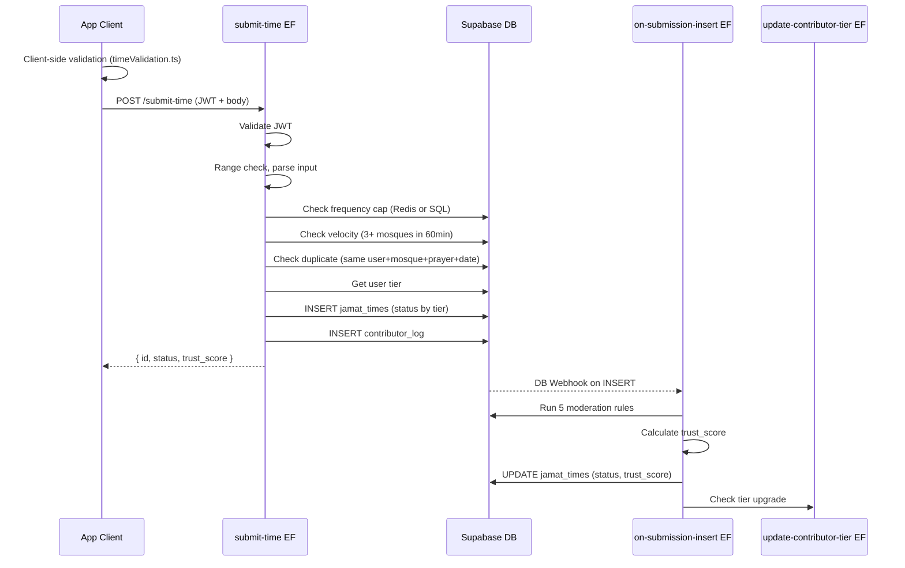

# FR-004 & FR-005 Implementation Plan

## Current State

- **Stubs to replace**: `supabase/functions/submit-time/` (does not exist yet), `on-submission-insert/index.ts` (501 stub), `decay-trust-scores/index.ts` (501 stub), `update-contributor-tier/index.ts` (501 stub)
- **Client stubs**: `src/hooks/useSubmitTime.ts` (empty), `src/lib/trustScore.ts` (noop), `src/lib/timeValidation.ts` (noop), `src/components/mosque/SubmissionForm.tsx` (placeholder text)
- **Existing infrastructure**: `src/services/api.ts` (ApiError pattern), `src/hooks/useRequireAuth.ts` (auth guard), all DB tables + RLS + enums in migrations 001-004, `src/types/mosque.ts` + `src/types/user.ts` (complete), `src/constants/prayers.ts` (PRAYER_ORDER only), `src/components/ui/Select.tsx` (working Gluestack wrapper)
- **Already working**: `TrustBadge.tsx` renders badges based on score thresholds (80/50/10)

## Architecture



## Layer 1: Pure Utilities (no dependencies)

### 1a. `src/lib/timeValidation.ts`

Replace the noop placeholder with:
- `PRAYER_RANGES` constant map: `{ fajr: { min: '03:00', max: '07:30' }, dhuhr: { min: '11:30', max: '14:30' }, ... }` per FR-004
- `isTimeInRange(prayer: PrayerType, timeStr: string): boolean` -- parses HH:MM and checks against range
- `getTimeRangeForPrayer(prayer: PrayerType): { min: string; max: string }`
- `validateSubmissionTime(prayer: PrayerType, timeStr: string): { valid: boolean; errorKey?: string }`
- All pure functions, no side effects, easily unit-testable

### 1b. `src/lib/trustScore.ts`

Replace the noop placeholder with:
- `BASE_SCORE` map: `{ mosque_admin: 100, trusted: 70, regular: 55, new_user: 40 }`
- `BADGE_THRESHOLDS`: `{ verified: 80, community: 50, unverified: 10 }`
- `calculateTrustScore({ tier, checkinCount, confirmationCount, hasConflict }): number`
  - Base from tier + `min(checkinCount * 5, 25)` + `min(confirmationCount * 2, 10)` - `(hasConflict ? 10 : 0)`
  - Clamped 0-100
- `getBadgeForScore(score: number): { label: string; variant: 'verified' | 'community' | 'unverified' | 'stale'; colorToken: string; iconName: string }`
- Mirrors server logic exactly -- used for optimistic UI and client-side display

### 1c. `src/constants/prayers.ts`

Extend with `PRAYER_RANGES` constant (time validation ranges). Keep `PRAYER_ORDER` as-is.

## Layer 2: Edge Functions (Server)

### 2a. `supabase/functions/submit-time/index.ts` (NEW)

Create this new function directory and file. Follows the pattern from `nearby-mosques/index.ts`:

- **CORS**: Same `corsHeaders` pattern
- **Auth**: Extract JWT from Authorization header, `supabase.auth.getUser(token)`, reject 401
- **Input**: Parse JSON body `{ mosque_id, prayer, time, effective_date?, note? }`
- **Validation pipeline** (stop at first failure):
  1. **Input validation**: mosque_id is UUID, prayer is valid enum, time matches HH:MM, note <= 120 chars
  2. **Range check**: Use same `PRAYER_RANGES` logic as client (duplicated in Deno)
  3. **Duplicate check**: Query `jamat_times` for same `submitted_by + mosque_id + prayer` where `created_at::date = today`
  4. **Frequency cap**: Upstash Redis `INCR rate:{user_id}:submissions:{date}` with TTL 86400s, reject if > 5
  5. **Velocity check**: Query `jamat_times` by `submitted_by` where `created_at > now() - interval '60 minutes'`, count distinct `mosque_id`, reject if >= 3
- **Determine status**: Fetch user's `tier` from `users` table. `new_user` -> `'pending'`, all others -> `'live'`
- **Calculate initial trust_score**: `BASE_SCORE[tier]` (same map as client)
- **INSERT**: Into `jamat_times` with all fields
- **Log**: INSERT into `contributor_log` with `action_type='submission'`, `accepted=true`
- **Response**: 201 `{ id, status, trust_score }`
- **Errors**: Use error codes from PROJECT_SPEC: `TIME_OUT_OF_RANGE` (400), `DUPLICATE` (409), `FREQUENCY_CAP` (429), `RULE_VELOCITY` (422)

**Upstash Redis setup**: Import `@upstash/redis` from esm.sh. Use `UPSTASH_REDIS_URL` and `UPSTASH_REDIS_TOKEN` env vars. Include a setup guide section in implementation.

### 2b. `supabase/functions/on-submission-insert/index.ts`

Replace the 501 stub. This is triggered as a **Supabase Database Webhook** (configured via dashboard or migration) on INSERT to `jamat_times`:

- **Trigger payload**: Receives the new row via webhook body
- **Auth**: Uses service role (internal function, not user-facing)
- **Moderation rules** (FR-017, 5 rules in order):
  1. **Time range**: Re-validate prayer time range (defense in depth)
  2. **Velocity**: Check user submitted for 3+ different mosques in 60min
  3. **Duplicate content**: Check if identical time exists for same mosque/prayer from ANY source in past 7 days
  4. **Frequency cap**: Verify user hasn't exceeded 5/day (re-check, may have been concurrent)
  5. **Admin lock**: If mosque has `verified_admin_id` AND admin has a live time for this prayer, set status to `'pending'` instead of rejecting
- **Trust score calculation**:
  - Fetch all submissions for same `mosque_id + prayer` that are `live` or `pending`
  - For each: count confirming check-ins, count mosque confirmations, detect same-tier conflicts
  - Calculate score using same formula as `src/lib/trustScore.ts`
  - Update `trust_score` on each competing submission
- **Status update**: If any rule rejects, UPDATE to `status='rejected'`, log to `moderation_log`
- **Side effects**: 
  - Write to `contributor_log` if status changed
  - If submission accepted (status='live'), invoke `update-contributor-tier` via `supabase.functions.invoke()`

### 2c. `supabase/functions/update-contributor-tier/index.ts`

Replace the 501 stub:

- **Input**: `{ user_id }` (internal call from on-submission-insert)
- **Auth**: Service role only (not user-facing)
- **Logic**:
  - Count accepted submissions from `contributor_log` where `action_type='submission' AND accepted=true`
  - Thresholds: 0-4 = `new_user`, 5-19 = `regular`, 20+ = `trusted`
  - If new tier > current tier: UPDATE `users.tier` and `users.tier_last_active_at`
  - Also update `tier_last_active_at` on every call (any contribution = activity)
- **Response**: `{ tier, upgraded: boolean }`

### 2d. `supabase/functions/decay-trust-scores/index.ts`

Replace the 501 stub. **Important architectural decision**: The existing pg_cron job in migration 004 already calls `decay_trust_scores()` and `demote_inactive_contributors()` SQL functions directly -- these are kept as-is for reliability. This Edge Function handles only **the 7-day warning notification** which requires HTTP (push notification):

- **Trigger**: Called by a new pg_cron entry via `pg_net` HTTP extension, running Monday 02:00 UTC (same schedule as decay)
- **Auth**: Service role + verify internal call (check for a shared secret or simply validate it comes from the same Supabase project)
- **Logic**:
  1. Query users WHERE `tier IN ('regular', 'trusted') AND tier_last_active_at < now() - interval '53 days' AND tier_last_active_at >= now() - interval '54 days'` (7 days before demotion window)
  2. For each user: look up FCM/APNs token, send push warning: "Your [Tier] status expires in 7 days -- submit or check in to keep it"
  3. Log the warning to `contributor_log` with `action_type='seasonal_prompt'` (or a new type if we want to differentiate)
- **Fallback**: If no users match, return `{ warned: 0 }` and exit early

### 2e. Database Webhook Configuration

A new migration file to set up the database webhook for `on-submission-insert`:
- Create a `pg_net` based trigger or configure via Supabase Dashboard webhook settings
- Alternatively, use a Postgres trigger function that calls `net.http_post()` to invoke the Edge Function

## Layer 3: Client Hooks

### 3a. `src/hooks/useSubmitTime.ts`

Replace the empty stub:

```typescript
interface UseSubmitTimeReturn {
  submitTime: (data: SubmitTimeInput) => Promise<SubmitTimeResult>;
  isSubmitting: boolean;
  error: ApiError | null;
  validateLocally: (prayer: PrayerType, time: string) => ValidationResult;
  clearError: () => void;
}
```

- **Client-side pre-validation**: Call `validateSubmissionTime()` from `src/lib/timeValidation.ts` for instant feedback
- **API call**: `supabase.functions.invoke('submit-time', { body })` using the existing `ApiError` pattern from `src/services/api.ts`
- **Error mapping**: Map server error codes to i18n keys (`error.TIME_OUT_OF_RANGE`, `error.DUPLICATE`, etc.)
- **Auth guard**: Use `useRequireAuth()` to ensure user is authenticated before submission
- **State**: `isSubmitting` loading flag, `error` for display

### 3b. Add `submitTime` to `src/services/api.ts`

Add a new function alongside `fetchNearbyMosques`:

```typescript
export async function submitTime(data: SubmitTimeInput): Promise<SubmitTimeResult> {
  // supabase.functions.invoke('submit-time', { body: data })
  // Handle ApiError pattern like fetchNearbyMosques
}
```

## Layer 4: UI Components

### 4a. `src/components/mosque/SubmissionForm.tsx`

Replace the placeholder. Build as a **bottom sheet** using `@gorhom/bottom-sheet` or the Gluestack actionsheet pattern (the project already has `select-actionsheet.tsx` in gluestack-ui):

- **Prayer picker**: Reuse existing `Select` component (`src/components/ui/Select.tsx`) with `PRAYER_ORDER` options
- **Time input**: Custom time picker with hours (1-12) and minutes (00-59) selectors + AM/PM toggle. Use `TextInput` with numeric keyboard for simplicity, formatted display
- **Date picker**: Default to today, allow selecting up to 7 days back. Simple date pills or a modal date picker
- **Note field**: `Input` component (existing) with `maxLength={120}` + character counter
- **Validation**: Inline error messages below each field, using `validateSubmissionTime()` on time blur
- **Submit button**: `Button` component with `isLoading` state
- **Success state**: Toast notification on success, close sheet
- **Props**: `{ mosqueId: string; mosqueName: string; onClose: () => void; onSuccess?: () => void }`

### 4b. `app/submit-time/[mosqueId].tsx`

Replace the minimal scaffold:

- Fetch mosque name from Supabase by `mosqueId` (can reuse `useMosqueProfile` or a lighter query)
- Render `SubmissionForm` as the main content (full screen with header, not a bottom sheet in this context since it's a dedicated route)
- Back button in header
- Show mosque name in header
- **Alternative**: If we want the bottom sheet approach per the spec, this screen could trigger the sheet from the mosque profile instead. The route still exists as a deep-link entry point.

## Layer 5: i18n Strings

Add to `src/i18n/en.json`:

```json
{
  "submit.title": "Submit Jamat Time",
  "submit.prayerLabel": "Prayer",
  "submit.prayerPlaceholder": "Select prayer",
  "submit.timeLabel": "Jamat time",
  "submit.timePlaceholder": "e.g. 5:15 AM",
  "submit.dateLabel": "Effective date",
  "submit.noteLabel": "Note (optional)",
  "submit.notePlaceholder": "e.g. Confirmed with imam",
  "submit.noteCount": "{{count}}/120",
  "submit.button": "Submit Time",
  "submit.success": "Time submitted successfully",
  "submit.successPending": "Time submitted for review",
  "error.TIME_OUT_OF_RANGE": "This time seems unusual for {{prayer}} prayer",
  "error.DUPLICATE": "You've already submitted this today",
  "error.FREQUENCY_CAP": "Maximum 5 submissions per day reached",
  "error.RULE_VELOCITY": "You've submitted for too many mosques recently",
  "error.SUBMISSION_FAILED": "Could not submit time. Please try again."
}
```

## Layer 6: Supporting Infrastructure

### 6a. Upstash Redis Setup Guide

Document in the codebase how to configure Upstash Redis for rate limiting:
- Add `UPSTASH_REDIS_URL` and `UPSTASH_REDIS_TOKEN` to `.env.example`
- Add to Supabase Edge Function secrets: `supabase secrets set UPSTASH_REDIS_URL=... UPSTASH_REDIS_TOKEN=...`
- The submit-time function imports `@upstash/redis` from esm.sh for Deno compatibility

### 6b. Database Webhook for on-submission-insert

Options (in order of preference):
1. **Supabase Dashboard**: Configure webhook on `jamat_times` INSERT pointing to the Edge Function URL
2. **Migration with pg_net**: `SELECT net.http_post(...)` inside a trigger function (requires pg_net extension)

### 6c. New Migration for pg_cron Warning Job

Add a migration to schedule the decay-trust-scores Edge Function call via pg_net for the 7-day warning notifications.

## Implementation Order

The implementation should proceed bottom-up (utilities first, then server, then client):

1. Pure utilities (`timeValidation.ts`, `trustScore.ts`, `prayers.ts` extension)
2. Edge Function: `submit-time/index.ts`
3. API client: `submitTime` in `api.ts`
4. Client hook: `useSubmitTime.ts`
5. UI: `SubmissionForm.tsx` + `[mosqueId].tsx` screen
6. i18n strings
7. Edge Function: `on-submission-insert/index.ts`
8. Edge Function: `update-contributor-tier/index.ts`
9. Edge Function: `decay-trust-scores/index.ts`
10. Database webhook + cron migration
11. Upstash Redis setup guide

## Key Risks and Mitigations

- **No Actionsheet/BottomSheet component installed**: The project has Gluestack's select-actionsheet but no general-purpose bottom sheet. We need to either install `@gorhom/bottom-sheet` or use the Gluestack Actionsheet primitive. Will check what Gluestack v3 offers for this.
- **Toast component is a stub**: `src/components/ui/Toast.tsx` is a placeholder. We need to implement or install a toast solution for success/error feedback. Can use Gluestack's Toast or `react-native-toast-message`.
- **Database webhook vs trigger**: Supabase Database Webhooks are the simplest approach but require dashboard config. For reproducibility, a pg_net trigger in a migration is better.
- **Upstash Redis in Deno**: Import via `https://esm.sh/@upstash/redis@latest` -- this works in Supabase Edge Functions per Upstash docs.
