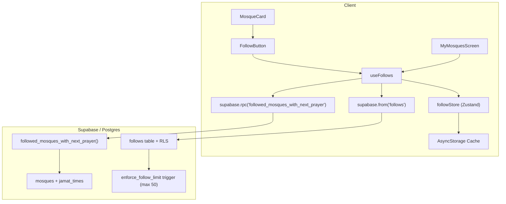

# FR-006 Follow System Implementation Plan

## Current State

- **`follows` table** exists in DB with RLS (`follows_own` policy, `FOR ALL`, `USING (user_id = auth.uid())`). Schema matches PROJECT_SPEC.
- **`FollowButton`** exists with local-only AsyncStorage read/write + haptic feedback, but **no animation** and **no Supabase sync**.
- **`useFollows`** is a **stub** returning `{}`.
- **`my-mosques.tsx`** is a **placeholder** rendering centered text.
- **`MosqueCard`** already embeds `FollowButton` and expects `NearbyMosque` type.
- **No Zustand store** for follows -- follow state is siloed inside `FollowButton` component via `useState` + direct AsyncStorage.

## Architecture



### Dual-mode follow (anonymous vs authenticated)

- **Anonymous**: follows stored in AsyncStorage only. `useFollows.followMosque()` writes to Zustand + AsyncStorage. No server call.
- **Authenticated**: same optimistic local update, then INSERT/DELETE on `follows` table. On sign-in, local follows are pushed to server (upsert, ON CONFLICT DO NOTHING), then server follows are pulled as source of truth.

---

## 1. New Postgres function + trigger (migration)

Create `supabase/migrations/007_followed_mosques_function.sql`:

**`followed_mosques_with_next_prayer()`** -- mirrors `nearby_mosques_with_next_prayer()` but takes an array of mosque IDs instead of a geographic point. Returns `NearbyMosque`-shaped rows sorted by next jamat time (nulls last). Distance computed via PostGIS from the caller's lat/lng.

Key SQL structure:

```sql
CREATE OR REPLACE FUNCTION public.followed_mosques_with_next_prayer(
  p_mosque_ids UUID[],
  p_lat DOUBLE PRECISION,
  p_lng DOUBLE PRECISION,
  p_current_local_time TIME DEFAULT LOCALTIME
)
RETURNS TABLE (
  id UUID, name TEXT, distance_km DOUBLE PRECISION,
  next_prayer prayer_type, next_jamat_time TIMETZ,
  next_trust_score INT, facilities JSONB, is_tomorrow BOOLEAN
)
```

Uses the same LATERAL join pattern as `nearby_mosques_with_next_prayer` for next-prayer computation.

**`enforce_follow_limit` trigger** -- BEFORE INSERT on `follows`, raises exception if user already has 50 follows. Returns error code `FOLLOW_LIMIT_REACHED`.

Grant EXECUTE to `anon, authenticated`.

---

## 2. Zustand follow store

Create [src/store/followStore.ts](src/store/followStore.ts):

- **State**: `followedIds: string[]`, `hydrated: boolean`
- **Actions**: `addId(id)`, `removeId(id)`, `setIds(ids)`, `hydrate()`
- **`hydrate()`**: reads `LOCAL_FOLLOW_IDS_KEY` from AsyncStorage, sets `followedIds` and `hydrated = true`
- Every mutation (add/remove/set) persists to AsyncStorage synchronously with the store update
- Selector: `isFollowing(id)` -- derived from `followedIds.includes(id)`

This replaces the per-component `useState` + direct AsyncStorage pattern in the current `FollowButton`.

---

## 3. `useFollows` hook

Rewrite [src/hooks/useFollows.ts](src/hooks/useFollows.ts):

**Returned interface:**
```typescript
interface UseFollowsResult {
  followedIds: string[];
  isFollowing: (mosqueId: string) => boolean;
  followMosque: (mosqueId: string) => Promise<void>;
  unfollowMosque: (mosqueId: string) => Promise<void>;
  followedMosques: NearbyMosque[];
  followedMosquesLoading: boolean;
  followedMosquesError: string | null;
  refreshFollowedMosques: () => Promise<void>;
  syncFollows: () => Promise<void>;
}
```

**Key behaviors:**

- **`followMosque(id)`**: optimistic add to store -> if authenticated, INSERT into `follows` (catch error -> revert store). Check local count < 50 before inserting.
- **`unfollowMosque(id)`**: optimistic remove from store -> if authenticated, DELETE from `follows` (catch error -> revert store).
- **`isFollowing(id)`**: reads from Zustand store (instant).
- **`syncFollows()`**: called when auth state changes to authenticated. Pushes local IDs to server (upsert), then pulls server IDs as source of truth and updates store + AsyncStorage.
- **`refreshFollowedMosques()`**: calls `supabase.rpc('followed_mosques_with_next_prayer', {...})` with current follow IDs + user location. Maps results to `NearbyMosque[]`. Sorted by next jamat time (server-side).

**Auth awareness:** reads `isAuthenticated` and `session` from `useAuthStore` (same pattern as `useAuth`). No server calls when not authenticated.

---

## 4. Refactor `FollowButton`

Modify [src/components/mosque/FollowButton.tsx](src/components/mosque/FollowButton.tsx):

**Changes:**
- Replace internal `useState` + direct AsyncStorage with `useFollows` hook (`isFollowing`, `followMosque`, `unfollowMosque`)
- Remove `readFollowIds()` / `writeFollowIds()` helper functions (now in store)
- Add **reanimated scale bounce** animation: on toggle, animate scale `1 -> 1.3 -> 1` over 200ms using `withSequence(withTiming(...))`. Respect `useReducedMotion()`.
- Keep existing haptic feedback (`ImpactFeedbackStyle.Light`)
- Keep existing accessibility props

The component becomes much simpler since all state management moves to the hook.

---

## 5. My Mosques screen

Rewrite [app/(tabs)/my-mosques.tsx](app/(tabs)/my-mosques.tsx):

**Structure:**
- Uses `useFollows` hook for `followedMosques`, `followedMosquesLoading`, `refreshFollowedMosques`
- Uses `useLocation` for user coordinates (needed for distance display)
- **FlatList** of `MosqueCard` components (same card as mosque list tab)
- **Pull-to-refresh** via `RefreshControl`
- **Loading state**: skeleton cards (reuse `MosqueCardSkeleton` pattern)
- **Empty state**: `EmptyState` component with `Heart` icon (Light weight, 48px) + title "Follow mosques to see them here" + subtitle + CTA "Browse Mosques" navigating to the Mosques tab
- **Error state**: `EmptyState` with warning icon + retry

The `onPress` callback navigates to mosque profile: `router.push(\`/mosque/\${mosque.id}\`)`.

Data sorted by next jamat time comes pre-sorted from the Postgres function.

---

## 6. i18n strings

Add to [src/i18n/en.json](src/i18n/en.json):

```json
"myMosques.title": "My Mosques",
"myMosques.empty.title": "Follow mosques to see them here",
"myMosques.empty.subtitle": "Tap the heart icon on any mosque to add it to your list.",
"myMosques.empty.cta": "Browse Mosques",
"myMosques.error.title": "Could not load your mosques",
"myMosques.error.subtitle": "Check your connection and try again.",
"myMosques.error.retry": "Try again",
"myMosques.followLimit": "You can follow up to 50 mosques",
"error.FOLLOW_LIMIT_REACHED": "You can follow up to 50 mosques"
```

---

## 7. Constants

Add to [src/constants/config.ts](src/constants/config.ts):

```typescript
export const MAX_FOLLOWS = 50;
```

---

## Key decisions

- **No new Edge Function**: the `followed_mosques_with_next_prayer` Postgres function is called via `supabase.rpc()` directly. RLS on mosques/jamat_times handles access (public read). This avoids edge function overhead for a read-only query.
- **Zustand store is the single source of truth** for follow IDs across the app. Both `FollowButton` and `MyMosquesScreen` read from it, so follow/unfollow in the mosque profile instantly updates the My Mosques tab.
- **50-follow limit** enforced both client-side (check before insert) and server-side (trigger). Client check gives instant feedback; server trigger is the authority.
- **Sync on auth**: when user signs in, `syncFollows()` merges local follows into server, then replaces local state with server state. No data loss.
