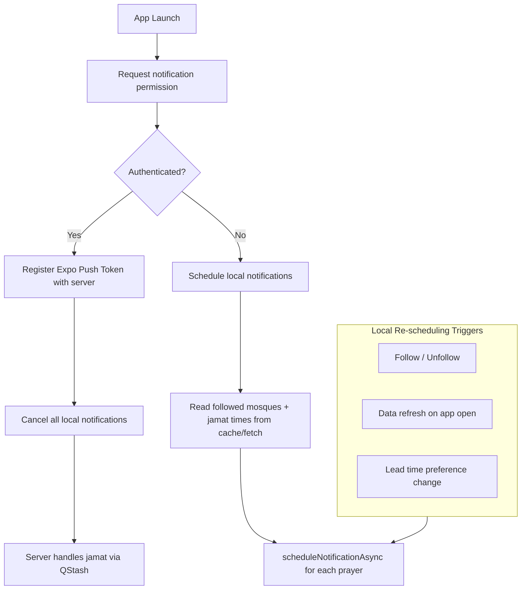
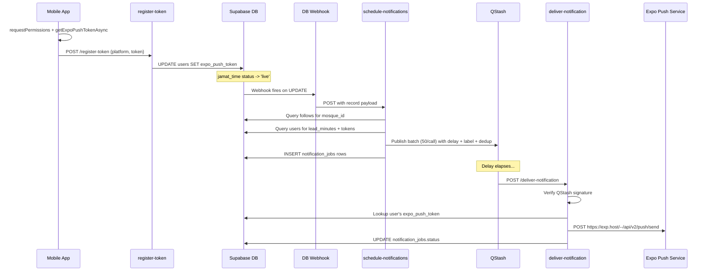

# FR-007: Dual-Tier Notification System

## Dual-Tier Architecture

The notification system serves **all users** -- not just authenticated ones. Two tiers handle the two user types, converging on the same permission flow, settings screen, and tap-to-navigate behavior.

| Tier | Users | Jamat time notifications | Prayer time notifications | Mechanism |
|---|---|---|---|---|
| **Local** | Anonymous (no account) | Scheduled on-device from cached/fetched jamat times | Designed now, wired when FR-010 lands | `Notifications.scheduleNotificationAsync` with date trigger |
| **Remote** | Authenticated | Server-side QStash queue -> Expo Push Service | Same local path as anonymous | Remote push via Expo Push API |

### Why Two Tiers

- Anonymous users follow mosques locally (AsyncStorage) and have cached jamat times -- everything needed to schedule on-device
- Server-side push requires a `user_id` for token storage, notification_jobs tracking, and QStash fan-out -- only available for authenticated users
- When an anonymous user signs in, local notifications are cancelled and the server takes over (clean handoff)



---

## Tier 1: Remote Push (Authenticated Users)

### Architecture



### Key Decision: Expo Push Service (MVP)

We use **Expo Push Tokens** instead of native FCM/APNs tokens:
- Client calls `getExpoPushTokenAsync()` (not `getDevicePushTokenAsync()`)
- Edge Function sends to Expo's HTTP Push API (`https://exp.host/--/api/v2/push/send`)
- No Firebase Admin SDK or APNs cert management needed in Deno
- Single token field: `expo_push_token` on the `users` table (replacing `fcm_token`/`apns_token` for MVP)
- **Future expansion**: add native FCM/APNs path by adding a `push_provider` column

### Database Changes

**Migration** via `supabase migration new add_expo_push_token`:

```sql
ALTER TABLE users ADD COLUMN expo_push_token TEXT;
```

Existing `fcm_token` and `apns_token` columns remain for future native push.

**Database Webhook** on `jamat_times` table for `UPDATE` events:
- **Condition**: `NEW.status = 'live' AND (OLD.status != 'live' OR NEW.time != OLD.time)`
- **URL**: `{SUPABASE_URL}/functions/v1/schedule-notifications`
- **Headers**: `Authorization: Bearer {DATABASE_WEBHOOK_SECRET}`
- Configured via Supabase Dashboard or SQL migration using `supabase_functions.hooks`

### Edge Function 1: `supabase/functions/register-token/index.ts` (NEW)

**Endpoint**: `POST /functions/v1/register-token` | **Auth**: JWT

- Extract JWT, validate with `supabase.auth.getUser(token)`
- Parse body: `{ platform: "android" | "ios", token: string }`
- Validate token is non-empty
- Service role client: `UPDATE users SET expo_push_token = $token, updated_at = now() WHERE id = $user_id`
- Return `{ ok: true }`
- Follow [on-submission-insert/index.ts](supabase/functions/on-submission-insert/index.ts) pattern (CORS, `jsonResponse` helper, structured errors)
- `config.toml`: `verify_jwt = true`

### Edge Function 2: `supabase/functions/schedule-notifications/index.ts` (REPLACE STUB)

**Endpoint**: `POST /functions/v1/schedule-notifications` | **Auth**: Webhook secret (not JWT)

```
1. Verify caller (DATABASE_WEBHOOK_SECRET / x-internal-secret)
2. Extract: mosque_id, prayer, time, effective_date from record
3. Confirm status == 'live', else return early
4. Build label: `${mosque_id}:${prayer}:${effective_date}`
5. CANCEL existing: DELETE QStash messages by label
6. DELETE notification_jobs WHERE mosque_id, prayer, date, status='queued'
7. Query followers + their lead_minutes + expo_push_token:
   SELECT f.user_id, u.notification_lead_minutes, u.expo_push_token
   FROM follows f JOIN users u ON f.user_id = u.id
   WHERE f.mosque_id = $mosque_id AND u.expo_push_token IS NOT NULL
8. Query mosque name from mosques table
9. For each follower:
   a. scheduled_time = effective_date + jamat_time - lead_minutes
   b. Skip if scheduled_time is in the past
   c. delay_seconds = scheduled_time - now()
   d. dedup key: `${mosque_id}:${prayer}:${effective_date}:${user_id}`
10. Batch enqueue to QStash (50 per batch):
    POST https://qstash.upstash.io/v2/publish/{deliver-notification-url}
    Headers: Authorization, Upstash-Delay, Upstash-Label, Upstash-Deduplication-Id
    Body: { user_id, mosque_name, prayer, jamat_time, lead_minutes }
11. INSERT notification_jobs rows with qstash_message_id, status='queued'
```

QStash uses `Upstash-Label` header for grouping; `label` query param on `DELETE /v2/messages` for cancellation.

`config.toml`: `verify_jwt = false`

### Edge Function 3: `supabase/functions/deliver-notification/index.ts` (REPLACE STUB)

**Endpoint**: `POST /functions/v1/deliver-notification` | **Auth**: QStash signature

```
1. Verify QStash signature (Receiver from @upstash/qstash)
2. Parse body: { user_id, mosque_name, prayer, jamat_time, lead_minutes }
3. Query users.expo_push_token WHERE id = user_id
4. If no token: notification_jobs status='failed', last_error='NO_TOKEN', return 200
5. POST https://exp.host/--/api/v2/push/send
   Body: { to, title: mosque_name, body: "${prayer} in ${lead_minutes} minutes",
           data: { mosque_id, prayer, type: "jamat_reminder" }, sound, priority }
6. Handle Expo errors (DeviceNotRegistered -> clear token)
7. Update notification_jobs: status='delivered', attempts++
8. On failure: return non-200 for QStash retry (3x: 30s, 120s, 480s)
```

`config.toml`: `verify_jwt = false`

---

## Tier 2: Local Scheduled Notifications (Anonymous Users)

### Design

Local notifications use `expo-notifications` `scheduleNotificationAsync` with a **date trigger**. No server, no push token, no auth needed.

### Notification ID Scheme

Deterministic identifiers enable precise cancellation:

| Type | ID format | Example |
|---|---|---|
| Jamat reminder | `jamat:{mosque_id_short}:{prayer}:{date}` | `jamat:abc12:asr:2026-04-12` |
| Prayer time | `prayer:{prayer}:{date}` | `prayer:fajr:2026-04-12` |

`mosque_id_short` = first 8 chars of UUID (to keep IDs short while staying unique enough).

### iOS 64-Notification Budget

iOS caps pending local notifications at **64**. Budget allocation:

```
5 followed mosques x 6 prayers = 30 jamat notifications
5 calculated prayer times          =  5 prayer notifications (future)
                                     ---
                              Total = 35 / 64 (today only)
```

Schedule **today only** (+ tomorrow's Fajr if after Isha). Re-schedule daily on app open.

### `src/lib/localNotificationScheduler.ts` (NEW -- pure logic, no React)

This module owns all local notification scheduling logic. It is deliberately React-free so it can be unit tested and called from both hooks and services.

```typescript
interface JamatNotificationInput {
  mosqueId: string;
  mosqueName: string;
  prayer: PrayerType;
  jamatTimeUtc: Date;       // effective_date + time in UTC
  leadMinutes: number;       // 10, 15, or 30
}

interface PrayerNotificationInput {
  prayer: PrayerType;
  prayerTimeUtc: Date;
  leadMinutes: number;
}

// Schedule a single jamat reminder; returns the notification identifier
async function scheduleJamatReminder(input: JamatNotificationInput): Promise<string>

// Cancel a single notification by identifier
async function cancelNotification(identifier: string): Promise<void>

// Cancel all jamat notifications for a specific mosque (on unfollow)
async function cancelForMosque(mosqueId: string): Promise<void>

// Cancel ALL local notifications (on sign-in transition to remote push)
async function cancelAllLocal(): Promise<void>

// Schedule jamat reminders for all followed mosques for today
// Returns count of notifications scheduled
async function scheduleForFollowedMosques(
  mosques: Array<{ id: string; name: string; jamatTimes: JamatTimeRow[] }>,
  leadMinutes: number,
): Promise<number>

// Re-schedule everything (on lead time change, data refresh, app foreground)
async function rescheduleAll(
  mosques: Array<{ id: string; name: string; jamatTimes: JamatTimeRow[] }>,
  leadMinutes: number,
): Promise<number>

// --- Prayer time notifications (designed now, wired with FR-010) ---

// Schedule prayer time reminders for today from calculated times
async function schedulePrayerTimeReminders(
  prayers: PrayerNotificationInput[],
): Promise<number>

// Build deterministic notification ID
function buildNotificationId(type: 'jamat' | 'prayer', ...parts: string[]): string
```

**Key behaviors:**
- `rescheduleAll` first calls `cancelAllLocal()` then re-schedules -- simple and correct
- Skips any notification whose trigger time is in the past
- Each scheduling call checks remaining budget against iOS 64 limit via `Notifications.getAllScheduledNotificationsAsync().length`

### `src/services/notifications.ts` (REPLACE PLACEHOLDER)

Orchestration layer that ties the local scheduler to app data:

```typescript
// For authenticated users: register push token with server
export async function registerPushToken(token: string, platform: 'android' | 'ios'): Promise<void>

// For anonymous users: schedule local notifications using cached mosque data
export async function scheduleLocalJamatNotifications(): Promise<void>
// reads followed mosque IDs from AsyncStorage
// reads jamat times from SQLite cache or fetches
// reads lead_minutes from local preferences (appStore)
// calls localNotificationScheduler.scheduleForFollowedMosques()

// Cancel notifications for a single mosque (called from useFollows on unfollow)
export async function cancelLocalForMosque(mosqueId: string): Promise<void>

// Schedule notifications for a single mosque (called from useFollows on follow)
export async function scheduleLocalForMosque(mosqueId: string): Promise<void>

// Transition: anonymous -> authenticated
export async function transitionToRemotePush(expoPushToken: string, platform: string): Promise<void>
// 1. cancelAllLocal()
// 2. registerPushToken(token, platform)

// Transition: authenticated -> sign out
export async function transitionToLocalPush(): Promise<void>
// 1. scheduleLocalJamatNotifications()
```

### `src/hooks/useNotifications.ts` (REPLACE STUB)

Dual-path hook that handles both tiers:

```typescript
export function useNotifications() {
  const session = useAuthStore((s) => s.session);
  const isAuthenticated = !!session;

  // --- Permission + Channel Setup (both tiers) ---

  async function requestPermission(): Promise<boolean>
  // requestPermissionsAsync()
  // Android: setNotificationChannelAsync('jamat-reminders', { name, importance, sound })

  // --- Tier-specific initialization ---

  async function initialize(): Promise<void>
  // if (isAuthenticated):
  //   getExpoPushTokenAsync() -> transitionToRemotePush()
  // else:
  //   scheduleLocalJamatNotifications()

  // --- Foreground handler (both tiers) ---
  useEffect(() => {
    Notifications.setNotificationHandler({
      handleNotification: async () => ({
        shouldShowAlert: true, shouldPlaySound: true,
        shouldSetBadge: false, shouldShowBanner: true, shouldShowList: true,
      }),
    });
  }, []);

  // --- Tap handler (both tiers -- same behavior) ---
  useEffect(() => {
    const sub = Notifications.addNotificationResponseReceivedListener((response) => {
      const data = response.notification.request.content.data;
      if (data?.mosque_id) router.push(`/mosque/${data.mosque_id}`);
    });
    return () => sub.remove();
  }, []);

  // --- Cold-start tap (both tiers) ---
  useEffect(() => {
    Notifications.getLastNotificationResponseAsync().then((response) => {
      if (response?.notification.request.content.data?.mosque_id) {
        router.push(`/mosque/${response.notification.request.content.data.mosque_id}`);
      }
    });
  }, []);

  // --- Auth state transition ---
  useEffect(() => {
    if (isAuthenticated) {
      // Cancel local, register remote
      transitionToRemotePush(...)
    } else {
      // Sign-out: switch back to local
      transitionToLocalPush()
    }
  }, [isAuthenticated]);

  return { permissionStatus, requestPermission, initialize };
}
```

### Follow Hook Integration

In `src/hooks/useFollows.ts`, wire local notification scheduling into follow/unfollow:

```typescript
// On follow (anonymous):
await scheduleLocalForMosque(mosqueId);

// On unfollow (anonymous):
await cancelLocalForMosque(mosqueId);
```

Guarded by `!isAuthenticated` -- authenticated users rely on the server pipeline.

---

## Tier 3 (Designed, Not Wired): Prayer Time Notifications

Prayer time notifications are inherently **local** for all users (calculated from GPS via adhan algorithms). The `localNotificationScheduler.ts` includes the `schedulePrayerTimeReminders` interface but it will be wired when FR-010 (Prayer Times) is implemented.

When FR-010 lands:
- `usePrayerTimes` calculates today's prayer times
- Calls `schedulePrayerTimeReminders()` with the calculated times
- Settings screen gets a second toggle: "Notify at prayer times" (separate from jamat reminders)
- Uses the `prayer:{prayer}:{date}` ID scheme

---

## Settings Screen: `app/settings/notifications.tsx` (REPLACE PLACEHOLDER)

Works for **both** anonymous and authenticated users.

**UI Components:**
- Screen title: "Notifications" (Bell icon)
- Permission status card (Bell / BellSlash from Phosphor)
  - If denied: "Enable Notifications" button -> `requestPermission()`
  - If granted: green checkmark + status text
- **Jamat reminder toggle** (on/off) -- controls whether notifications fire at all
- **Lead time picker** (segmented control or Select):
  - Options: 10 min, 15 min (default), 30 min
- Description: "Get reminded before jamat times at your followed mosques."

**Data flow:**
- **Anonymous**: lead time stored in AsyncStorage via `appStore`; on change, calls `rescheduleAll()`
- **Authenticated**: lead time stored in `users.notification_lead_minutes` via Supabase; on change, also updates `appStore` for local cache

**Note**: The `appStore` needs a new field `notificationLeadMinutes` (default 15) so anonymous users can persist their preference. Authenticated users sync this bidirectionally with the `users` table.

**Icons**: `Bell`, `BellSlash`, `Clock` (from [ICONS.md](docs/ICONS.md))

---

## Zustand Store Changes

### `src/store/appStore.ts`

Add notification-related local preferences:

```typescript
interface AppState {
  ready: boolean;
  notificationLeadMinutes: 10 | 15 | 30;  // NEW -- persisted in AsyncStorage
  jamatNotificationsEnabled: boolean;       // NEW -- master toggle
  setNotificationLeadMinutes: (m: 10 | 15 | 30) => void;
  setJamatNotificationsEnabled: (enabled: boolean) => void;
}
```

Persist with AsyncStorage (same pattern as other local preferences).

---

## i18n Keys to Add ([src/i18n/en.json](src/i18n/en.json))

```json
{
  "settings.notifications.title": "Notifications",
  "settings.notifications.leadTimeLabel": "Notify me before jamat",
  "settings.notifications.leadTime10": "10 minutes before",
  "settings.notifications.leadTime15": "15 minutes before",
  "settings.notifications.leadTime30": "30 minutes before",
  "settings.notifications.permissionGranted": "Notifications are enabled",
  "settings.notifications.permissionDenied": "Notifications are disabled. Enable them in your device settings.",
  "settings.notifications.enableButton": "Enable Notifications",
  "settings.notifications.description": "Get reminded before jamat times at your followed mosques.",
  "settings.notifications.jamatToggle": "Jamat time reminders",
  "settings.notifications.jamatToggleDescription": "Receive a reminder before each jamat at your followed mosques.",
  "settings.notifications.prayerToggle": "Prayer time reminders",
  "settings.notifications.prayerToggleDescription": "Receive a reminder before each prayer time.",
  "notification.jamatReminder.title": "{{mosqueName}}",
  "notification.jamatReminder.body": "{{prayer}} in {{minutes}} minutes",
  "notification.prayerReminder.title": "Prayer Time",
  "notification.prayerReminder.body": "{{prayer}} in {{minutes}} minutes"
}
```

---

## `supabase/config.toml` Changes

```toml
[functions.register-token]
verify_jwt = true

[functions.schedule-notifications]
verify_jwt = false

[functions.deliver-notification]
verify_jwt = false
```

---

## Environment Variables Required

Already in `.env.example`, verify in Supabase Dashboard secrets:
- `QSTASH_TOKEN` -- for publishing messages
- `QSTASH_CURRENT_SIGNING_KEY` -- for verifying inbound signatures
- `QSTASH_NEXT_SIGNING_KEY` -- for key rotation
- `DATABASE_WEBHOOK_SECRET` -- for webhook auth on schedule-notifications
- `INTERNAL_FUNCTION_SECRET` -- already used by on-submission-insert

Expo Push API requires no secret (unauthenticated for Expo push tokens).

---

## Edge Cases

| Scenario | Handling |
|---|---|
| **Remote tier** | |
| Time update for same mosque/prayer/date | Cancel QStash messages by label, delete queued jobs, re-enqueue |
| Scheduled time already passed | Skip enqueue for that user |
| User has no push token | Skip, log as 'failed' with 'NO_TOKEN' |
| Token expired (DeviceNotRegistered) | Clear expo_push_token from users table |
| QStash delivery failure | 3x retry (30s, 120s, 480s); final fail -> status 'failed' |
| Duplicate scheduling (function retry) | QStash dedup key prevents double-send (10min window) |
| User unfollows before delivery | Sends anyway (acceptable; no future ones) |
| Edge Function timeout (30s) | Batch at 50/batch stays within budget |
| **Local tier** | |
| iOS 64-notification limit | Schedule today only; check budget before each batch |
| App not opened for days | Stale notifications fire with outdated times; re-schedule on next open |
| Data refresh shows changed time | `rescheduleAll()` cancels old + schedules new |
| User follows 6th mosque | Budget still OK (36 < 64); warn at 8+ mosques |
| Sign-in transition | `cancelAllLocal()` then register remote -- no duplicates |
| Sign-out transition | `transitionToLocalPush()` schedules from cached data |
| Notification permission denied | Show settings prompt; no scheduling attempted |
| Simulator / non-physical device | Skip token registration gracefully (expo-device check) |

---

## Implementation Order

Recommended sequence to minimize integration risk:

1. **Migration** -- add `expo_push_token` column
2. **`localNotificationScheduler.ts`** -- pure logic, unit-testable in isolation
3. **`src/services/notifications.ts`** -- orchestration layer
4. **`useNotifications` hook** -- dual-path with auth detection
5. **`app/settings/notifications.tsx`** -- settings screen (both tiers)
6. **`appStore` changes** -- local notification preferences
7. **i18n keys** -- all notification strings
8. **`register-token` Edge Function** -- server token registration
9. **`schedule-notifications` Edge Function** -- QStash enqueue
10. **`deliver-notification` Edge Function** -- QStash callback + Expo Push
11. **`config.toml`** -- verify_jwt settings
12. **Database Webhook** -- wire jamat_times -> schedule-notifications
13. **`_layout.tsx` integration** -- auto-initialize on launch
14. **`useFollows` integration** -- schedule/cancel on follow/unfollow

---

## Future Expansion Notes (Document Only)

- **Phase 1.5 (FR-015)**: Per-mosque per-prayer notification prefs via `follows.notification_prefs->{prayer}->lead_minutes`. No architecture change.
- **Native FCM/APNs**: Add `push_provider` column. Branch in deliver-notification. Requires Firebase service account JWT in Deno.
- **Prayer time notifications**: Wire `schedulePrayerTimeReminders` when FR-010 lands. Add toggle in settings. Always local (calculated client-side).
- **Background refresh**: When FR-010 adds background fetch, re-schedule local notifications from background task to keep times fresh even without app open.
