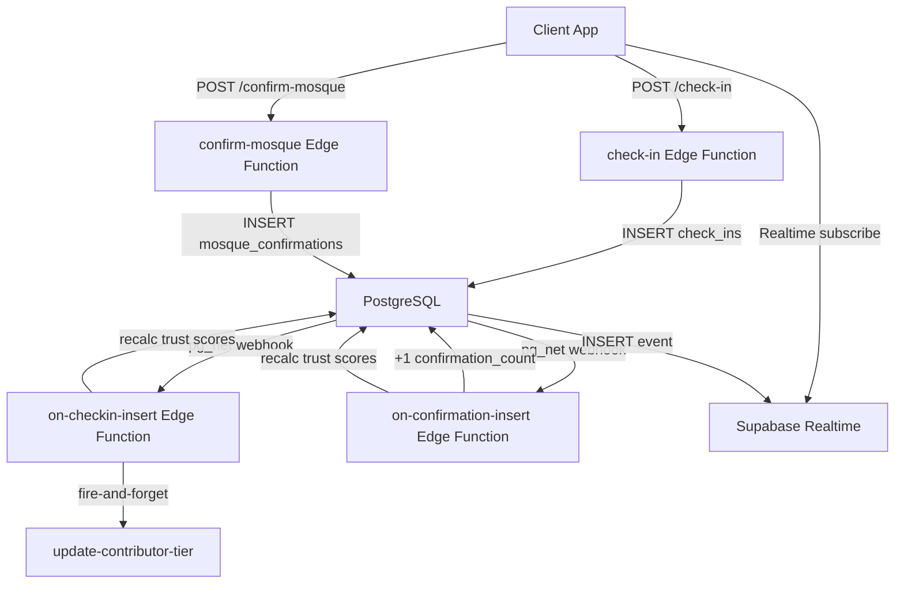

# FR-008 + FR-008B: Check-In and Mosque Confirmation System

## Architecture Overview

Two-function pipeline for each feature: user-facing Edge Function handles validation + insert, webhook Edge Function handles async side effects (trust recalculation, contributor tier update, contributor logging).



---

## Layer 1: Database Migration

**New file:** `supabase/migrations/009_checkin_confirmation_webhooks.sql`

- Add `pg_net` webhook triggers on `check_ins` (INSERT) and `mosque_confirmations` (INSERT) tables, mirroring the existing pattern in [20260412124020_schedule_notifications_webhook.sql](supabase/migrations/20260412124020_schedule_notifications_webhook.sql).
- No new tables needed -- `check_ins` and `mosque_confirmations` already exist in [002_create_tables.sql](supabase/migrations/002_create_tables.sql).
- No new RLS policies needed -- [003_create_rls_policies.sql](supabase/migrations/003_create_rls_policies.sql) already has `checkins_insert_auth`, `checkins_select`, `mosque_confirmations_insert_own`, and `mosque_confirmations_select_own`.

**Index consideration:** The existing `idx_checkins_mosque_prayer` on `(mosque_id, prayer, arrived_at)` covers the live count query. No additional indexes needed.

---

## Layer 2: Edge Function -- `supabase/functions/check-in/index.ts` (NEW)

User-facing, JWT-validated. Replace the 501 stub at [on-checkin-insert stub](supabase/functions/on-checkin-insert/index.ts) is separate -- this is a NEW function directory.

**Wait -- there is no `check-in` directory yet.** Need to create `supabase/functions/check-in/index.ts`.

### Request/Response Contract (from [PROJECT_SPEC SS7.4](docs/PROJECT_SPEC.md))

```
POST /functions/v1/check-in
Authorization: Bearer <jwt>
Body: { mosque_id, prayer, latitude, longitude, started_at? }
Response 201: { id, live_count }
Errors: OUTSIDE_GEOFENCE (400), VELOCITY_LIMIT (400), OUTSIDE_WINDOW (400), DUPLICATE (409)
```

### Validation Steps (in order)

1. **JWT auth** -- extract user via `supabase.auth.getUser(token)`
2. **Parse body** -- validate UUID `mosque_id`, enum `prayer`, finite lat/lng, optional ISO `started_at`
3. **Auto-detect prayer** -- if `prayer` is not provided, query `jamat_times` for the mosque and pick the prayer whose jamat time is closest to now within the -30min/+15min window. If none found, return `OUTSIDE_WINDOW`.
4. **Geofence** -- single PostGIS query:
   ```sql
   SELECT id, location FROM mosques
   WHERE id = $1
   AND ST_DWithin(location, ST_Point($lng, $lat)::geography, 300)
   ```
   GPS coordinates are used in memory only, never stored.
5. **Window check** -- fetch the `live` jamat_time for this mosque+prayer; posted time must satisfy: `now >= jamat_time - 30min AND now <= jamat_time + 15min`. If no live jamat_time exists, reject with `OUTSIDE_WINDOW`.
6. **Velocity check** -- query `check_ins` for this user in the last 20 minutes at a DIFFERENT mosque:
   ```sql
   SELECT mosque_id FROM check_ins
   WHERE user_id = $uid AND arrived_at > now() - interval '20 minutes'
   AND mosque_id != $mosque_id
   LIMIT 1
   ```
7. **Duplicate check** -- rely on the unique index `idx_checkins_dedup` on `(user_id, mosque_id, prayer, date)`. Catch Postgres error code `23505`.
8. **Insert** -- via service role client:
   ```sql
   INSERT INTO check_ins (user_id, mosque_id, prayer, arrived_at, started_at, delta_minutes, geofence_validated)
   ```
   - `delta_minutes`: if `started_at` provided, compute `EXTRACT(EPOCH FROM (started_at - jamat_time)) / 60` rounded to 1 decimal
   - `geofence_validated: true`
9. **Live count** -- count today's check-ins for this mosque+prayer:
   ```sql
   SELECT COUNT(*) FROM check_ins
   WHERE mosque_id = $1 AND prayer = $2
   AND arrived_at::date = CURRENT_DATE
   ```
10. **Return** `{ id, live_count }` with status 201.

### Config

Add to [supabase/config.toml](supabase/config.toml):
```toml
[functions.check-in]
verify_jwt = true
```

---

## Layer 3: Edge Function -- `supabase/functions/confirm-mosque/index.ts` (NEW)

**Wait -- also no `confirm-mosque` directory.** Need to create it.

### Request/Response Contract (from [PROJECT_SPEC SS7.5](docs/PROJECT_SPEC.md))

```
POST /functions/v1/confirm-mosque
Authorization: Bearer <jwt>
Body: { mosque_id, latitude, longitude }
Response 201: { confirmation_count }
Errors: OUTSIDE_GEOFENCE (400), COOLDOWN (409)
```

### Validation Steps

1. **JWT auth**
2. **Parse body** -- validate UUID `mosque_id`, finite lat/lng
3. **Geofence** -- `ST_DWithin(..., 500)` (500m, wider than check-in)
4. **Cooldown** -- query `mosque_confirmations` for this user+mosque in last 30 days:
   ```sql
   SELECT id FROM mosque_confirmations
   WHERE user_id = $uid AND mosque_id = $mid
   AND confirmed_at > now() - interval '30 days'
   LIMIT 1
   ```
   Also fall back to catching unique index violation `23505`.
5. **Insert** `mosque_confirmations` via service role
6. **Read updated count** -- the `on-confirmation-insert` webhook will increment `confirmation_count`, but since it runs async, we do an atomic increment here too to return the correct count immediately:
   ```sql
   UPDATE mosques SET confirmation_count = confirmation_count + 1, last_confirmed_at = now() WHERE id = $mid
   RETURNING confirmation_count
   ```
7. **Return** `{ confirmation_count }` with status 201.

**Note:** The `on-confirmation-insert` webhook will handle trust score recalculation. The atomic increment in the user-facing function ensures the returned count is accurate immediately.

---

## Layer 4: Edge Function -- `supabase/functions/on-checkin-insert/index.ts` (REPLACE STUB)

Webhook-triggered (internal secret auth), follows the same pattern as [on-submission-insert/index.ts](supabase/functions/on-submission-insert/index.ts).

### Side Effects

1. **Verify caller** via `DATABASE_WEBHOOK_SECRET` or `INTERNAL_FUNCTION_SECRET`
2. **Extract record** from webhook payload
3. **Log to `contributor_log`** -- `action_type: 'checkin'`, `accepted: true`
4. **Trust score recalculation** -- for all live/pending `jamat_times` rows for this mosque+prayer:
   - Count geofence-validated check-ins in last 30 days
   - Get mosque `confirmation_count` (capped at 5)
   - Recalculate each competing submission's trust score using [trustScore.ts](supabase/functions/on-submission-insert/trustScore.ts)
5. **Update user `tier_last_active_at`** -- fire-and-forget to `update-contributor-tier`
6. **Return** `{ ok: true }`

### Config

Already in [config.toml](supabase/config.toml) with `verify_jwt = false` -- keep this since it's webhook-invoked.

---

## Layer 5: Edge Function -- `supabase/functions/on-confirmation-insert/index.ts` (REPLACE STUB)

### Side Effects

1. **Verify caller**
2. **Extract record**
3. **Log to `contributor_log`** -- `action_type: 'confirmation'`, `accepted: true`
4. **Trust score recalculation** -- for ALL prayers at this mosque (since confirmation is mosque-level, not prayer-specific):
   - For each distinct prayer with live/pending submissions, recalculate trust scores
   - Confirmation boost capped at +10 total (+2 per confirmation, max 5 confirmations counted)
5. **Update user `tier_last_active_at`** -- fire-and-forget
6. **Return** `{ ok: true }`

**Note:** The `confirmation_count` increment and `last_confirmed_at` update happen in the user-facing `confirm-mosque` function (Layer 3) for immediate response accuracy. The webhook only handles trust recalculation and logging.

### Config

Already in config.toml with `verify_jwt = false`.

---

## Layer 6: API Client -- `src/services/api.ts` (EXTEND)

Add two new functions to the existing [api.ts](src/services/api.ts):

### `checkIn(input)`

```typescript
interface CheckInInput {
  mosque_id: string;
  prayer: PrayerType;
  latitude: number;
  longitude: number;
  started_at?: string; // ISO 8601
}

interface CheckInResult {
  id: string;
  live_count: number;
}
```

Invokes `supabase.functions.invoke('check-in', { body })`. Error handling follows existing pattern (parse `data.error` into `ApiError`).

### `confirmMosque(input)`

```typescript
interface ConfirmMosqueInput {
  mosque_id: string;
  latitude: number;
  longitude: number;
}

interface ConfirmMosqueResult {
  confirmation_count: number;
}
```

---

## Layer 7: Hook -- `src/hooks/useCheckIn.ts` (REPLACE STUB)

### Interface

```typescript
interface UseCheckInResult {
  checkIn: (mosqueId: string, prayer: PrayerType, location: Coordinates, startedAt?: string) => Promise<CheckInResult>;
  isLoading: boolean;
  error: string | null;
  lastResult: CheckInResult | null;
  liveCount: number;
  isCheckedIn: boolean;
}
```

### Realtime Subscription

- Subscribe to `check_ins` table changes filtered by `mosque_id`, `prayer`, and today's date
- On `INSERT` event, increment local `liveCount` state
- Use `supabase.channel(...)` with `.on('postgres_changes', ...)` per Supabase Realtime v2 API

### Polling Fallback

- 60-second interval via `setInterval`
- Queries `check_ins` count for mosque+prayer+today via Supabase client (using the existing `checkins_select` RLS policy)
- Only active when Realtime is disconnected (track channel status)

### Check-in State

- On mount, query `check_ins` to check if user has already checked in today for this mosque+prayer
- If yes, set `isCheckedIn: true` and disable the button

### Dependencies

Uses `useLocation()` from [useLocation.ts](src/hooks/useLocation.ts) for coordinates, passed in by the button component.

---

## Layer 8: Hook -- `src/hooks/useConfirmMosque.ts` (REPLACE STUB)

### Interface

```typescript
interface UseConfirmMosqueResult {
  confirmMosque: (mosqueId: string, location: Coordinates) => Promise<ConfirmMosqueResult>;
  isLoading: boolean;
  error: string | null;
  lastConfirmedAt: string | null;
  confirmationCount: number;
  isOnCooldown: boolean;
}
```

### Cooldown Logic

- On mount, query user's last confirmation for this mosque
- If within 30 days, set `isOnCooldown: true`
- Show last confirmed date from query result

---

## Layer 9: Component -- `src/components/mosque/CheckInButton.tsx` (REPLACE SHELL)

Extends the existing shell at [CheckInButton.tsx](src/components/mosque/CheckInButton.tsx).

### Props

```typescript
interface CheckInButtonProps {
  mosqueId: string;
  prayer: PrayerType | null;   // auto-detected from mosque's next prayer
  jamatTime: string | null;    // for window display
}
```

### States

| State | Visual | Interaction |
|-------|--------|-------------|
| `available` | Primary filled, `CheckCircle` icon, "Check In" label | Tap triggers check-in |
| `loading` | Spinner replaces icon, disabled | Non-interactive |
| `success` | Green bg, animated `Check` icon, scale bounce, "Checked In" label | Non-interactive (timeout to locked) |
| `unavailable` | Muted bg, `Clock` icon, "Check-in opens at [time]" | Disabled |
| `disabled` | Muted bg, `Check` fill icon, "Checked in for [Prayer]" | Disabled |

### Success Animation (Reanimated)

- Scale bounce: `withSequence(withTiming(1.1, 150ms), withTiming(1.0, 150ms))`
- Background color: animated interpolation from primary to success
- Haptic: `Haptics.notificationAsync(NotificationFeedbackType.Success)`
- Respect `useReducedMotion()` -- skip animations when enabled

### Layout

- Full width, 56px height (`min-h-[56px]`)
- Shows `LiveCount` component below when count > 0

### Prayer Auto-Detection

The component receives `prayer` and `jamatTime` from the parent mosque profile screen. The profile screen already loads jamat times via `useMosqueProfile`. The component uses the current time to determine which prayer window is active and passes it to `useCheckIn`.

---

## Layer 10: Component -- `src/components/mosque/ConfirmMosqueButton.tsx` (REPLACE SHELL)

Extends the existing shell at [ConfirmMosqueButton.tsx](src/components/mosque/ConfirmMosqueButton.tsx).

### Props

```typescript
interface ConfirmMosqueButtonProps {
  mosqueId: string;
  confirmationCount: number;
  lastConfirmedAt: string | null;
}
```

### States

| State | Visual |
|-------|--------|
| `available` | Secondary outlined, `UserCheck` icon, "I've Been Here" |
| `loading` | Spinner, disabled |
| `cooldown` | Muted, "Confirmed [date]" with check icon |
| `success` | Brief green flash + toast |

### Behavior

- On success, show toast via Gluestack `Toast` component
- Update `confirmationCount` displayed on profile
- Haptic: `ImpactFeedbackStyle.Light`

---

## Layer 11: Component -- `src/components/mosque/LiveCount.tsx` (REPLACE PLACEHOLDER)

Replace the placeholder at [LiveCount.tsx](src/components/mosque/LiveCount.tsx).

### Props

```typescript
interface LiveCountProps {
  count: number;
  prayer: PrayerType;
}
```

### Visual

- Icon: `Users` (Phosphor) at 18px
- Text: "{{count}} people checked in for {{prayer}}" (i18n key)
- Color: `checkin-live` semantic token (maps to `success`)
- Font: `body-sm` (12sp)

### Animation (Reanimated)

- When `count` changes, the number slides up with fade (200ms)
- Subtle pulse animation on the `Users` icon when count increases
- Respect `useReducedMotion()`

---

## Layer 12: i18n Strings -- `src/i18n/en.json` (EXTEND)

Add keys for check-in and confirmation:

```json
{
  "checkIn.button.available": "Check In",
  "checkIn.button.loading": "Checking in...",
  "checkIn.button.success": "Checked In",
  "checkIn.button.unavailable": "Check-in opens at {{time}}",
  "checkIn.button.disabled": "Checked in for {{prayer}}",
  "checkIn.liveCount": "{{count}} people checked in for {{prayer}}",
  "checkIn.liveCountGeneric": "{{count}} people here",
  "confirm.button.available": "I've Been Here",
  "confirm.button.loading": "Confirming...",
  "confirm.button.cooldown": "Confirmed {{date}}",
  "confirm.button.success": "Mosque confirmed!",
  "confirm.toast.success": "Thanks for confirming this mosque!",
  "error.OUTSIDE_GEOFENCE": "You appear to be too far from this mosque",
  "error.VELOCITY_LIMIT": "You checked in recently elsewhere",
  "error.OUTSIDE_WINDOW": "Check-in window for this prayer has closed",
  "error.COOLDOWN": "You've already confirmed this mosque recently"
}
```

Also add to `ar.json`, `bn.json`, `ur.json` with translated equivalents.

---

## Layer 13: Mosque Profile Integration -- `app/mosque/[id].tsx` (MODIFY)

Update the mosque profile screen to:

1. Pass `prayer` and `jamatTime` props to `CheckInButton` (auto-detect the current prayer from `jamatTimes`)
2. Pass `confirmationCount` and `lastConfirmedAt` to `ConfirmMosqueButton`
3. Add helper function `getCurrentPrayer(jamatTimes)` that determines which prayer is in the active check-in window based on current time

---

## Layer 14: Supabase Config -- `supabase/config.toml` (MODIFY)

Add the new user-facing functions:

```toml
[functions.check-in]
verify_jwt = true

[functions.confirm-mosque]
verify_jwt = true
```

`on-checkin-insert` and `on-confirmation-insert` already have `verify_jwt = false` implicitly (webhook-triggered).

---

## Open Considerations

### Trust Score Reuse

The trust score calculation logic at [supabase/functions/on-submission-insert/trustScore.ts](supabase/functions/on-submission-insert/trustScore.ts) will be shared by `on-checkin-insert` and `on-confirmation-insert`. To avoid duplication, copy the `trustScore.ts` file into each function directory (Deno Edge Functions don't support shared imports across function directories without a monorepo setup).

### Realtime Channel Naming

Channel name convention: `checkin:${mosqueId}:${prayer}:${dateKey}` -- unique per mosque/prayer/day to avoid cross-talk.

### Confirmation Dedup Index

The existing unique index `idx_confirmations_dedup` uses `date_trunc('month', ...)` but the spec says "1 per user per mosque per 30 days." This means a confirmation on Jan 31 and Feb 1 would both succeed (different months) despite being 1 day apart. The Edge Function's explicit 30-day query handles this correctly, and the index serves as a safety net.

### Offline Behavior

Per [PROJECT_SPEC SS13](docs/PROJECT_SPEC.md): Check-in requires internet (geofence validation is server-side). If offline, show "Requires internet" message. Confirmation also requires internet for the same reason.
