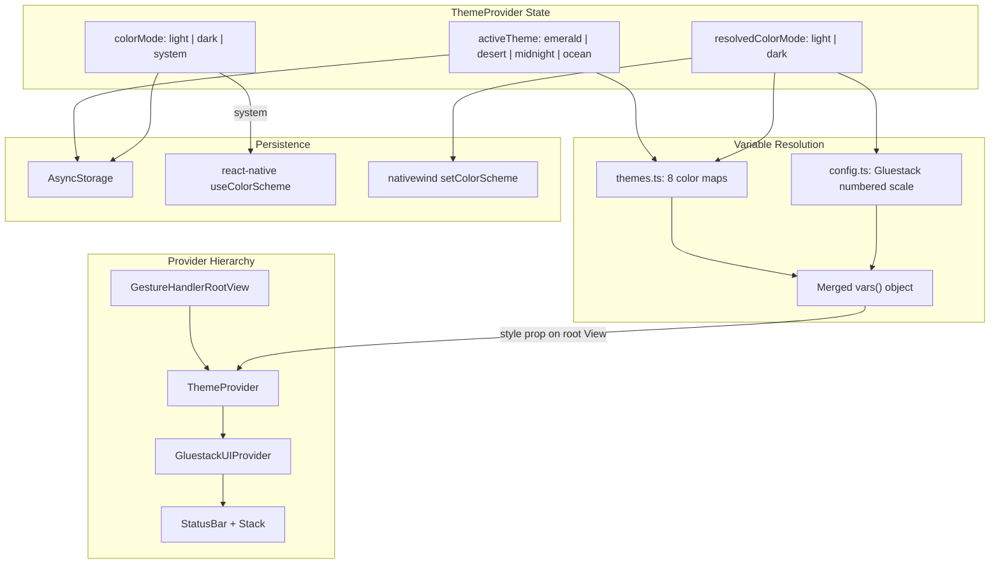
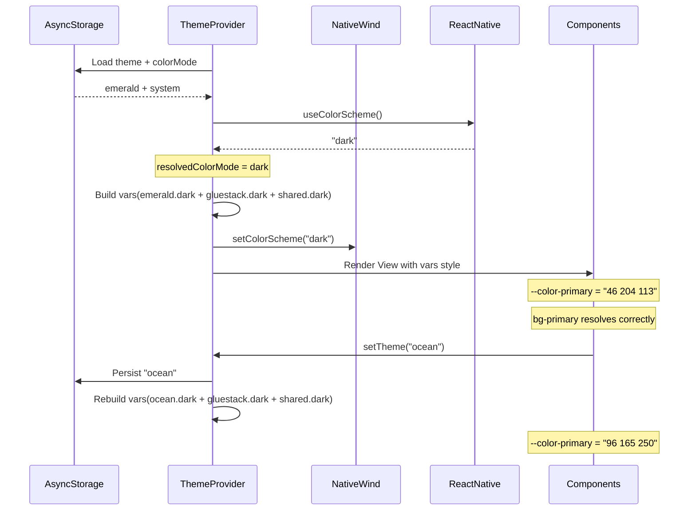

# Masjidy Theme System Implementation

## Current State

All theme files are stubs:
- [src/theme/themes.ts](src/theme/themes.ts) -- only exports `THEME_NAMES` type
- [src/theme/tokens.ts](src/theme/tokens.ts) -- placeholder
- [src/theme/ThemeProvider.tsx](src/theme/ThemeProvider.tsx) -- context with `{ ready: boolean }` only
- [src/theme/gluestack.config.ts](src/theme/gluestack.config.ts) -- empty note object
- [src/hooks/useTheme.ts](src/hooks/useTheme.ts) -- returns `{}`

The Gluestack provider at [src/components/gluestack-ui/gluestack-ui-provider/index.tsx](src/components/gluestack-ui/gluestack-ui-provider/index.tsx) applies CSS variables via NativeWind `vars()` on a root `View`, and manages color scheme via NativeWind's `useColorScheme`. Its config at [config.ts](src/components/gluestack-ui/gluestack-ui-provider/config.ts) has generic grey-scale values for a numbered Gluestack color scale (primary-0..950, background-0..950, etc.).

## Architecture



**Key decision**: ThemeProvider becomes the single owner of all CSS variables. The GluestackUIProvider is simplified to only provide Overlay + Toast contexts (no more `config[colorScheme]` on its View). This avoids duplicated variable application.

## Color Token Strategy

### Tailwind Color Naming

Masjidy semantic tokens are added to `tailwind.config.js` **alongside** the existing Gluestack numbered scale. The `DEFAULT` key pattern resolves conflicts:

```js
primary: {
  DEFAULT: 'rgb(var(--color-primary) / <alpha-value>)',  // bg-primary
  soft: 'rgb(var(--color-primary-soft) / <alpha-value>)', // bg-primary-soft
  0: 'rgb(var(--color-primary-0) / <alpha-value>)',       // bg-primary-0 (Gluestack)
  // ... 50 through 950
}
```

New semantic color keys added:

- `accent` / `accent.soft`
- `surface` / `surface.elevated` / `surface.muted`
- `text-primary`, `text-secondary`, `text-tertiary`
- `border` (no conflict -- Tailwind's `border` is a width utility, `border-border` sets color)
- `danger`
- `success.DEFAULT`, `warning.DEFAULT`, `info.DEFAULT` (merge with existing numbered scales)

Usage examples: `bg-surface`, `bg-primary`, `text-text-primary`, `text-primary` (for links), `border-border`, `bg-accent-soft`.

### CSS Variable Format

All values stored as space-separated RGB triplets (matching existing NativeWind `vars()` convention):
- `#1B6B4A` becomes `'27 107 74'`
- Tailwind references as `rgb(var(--color-primary) / <alpha-value>)` for opacity modifier support

### Shared Status Colors

success/warning/danger/info use the Emerald Oasis values across all 4 themes (per DESIGN_SYSTEM.md section 3.6). Only the 11 theme-specific tokens change per theme.

## Files to Create/Modify

### 1. `src/theme/themes.ts` (rewrite)

- Export `THEME_NAMES` const array and `ThemeName` type (keep existing)
- Export `ColorMode` type (`'light' | 'dark' | 'system'`)
- Export `ResolvedColorMode` type (`'light' | 'dark'`)
- Export `ThemeColorMap` interface (all 15 CSS variable names as keys)
- Export `THEMES` object: `Record<ThemeName, Record<ResolvedColorMode, ThemeColorMap>>` containing all 8 color maps with RGB triplet values converted from the hex values in DESIGN_SYSTEM.md sections 3.2-3.5
- Export `SHARED_STATUS_COLORS`: `Record<ResolvedColorMode, Record<string, string>>` for the 4 status tokens

### 2. `src/theme/tokens.ts` (rewrite)

- Export `SPACING` scale: `Record<string, number>` mapping `space-0` through `space-12` per section 5.1
- Export `BORDER_RADIUS` scale: `Record<string, number>` per section 5.2
- Export `SEMANTIC_TOKEN_MAP`: maps semantic names to base tokens (e.g., `badge-verified` -> `success`, `prayer-active` -> `primary`, etc.) per section 3.6

### 3. `src/theme/ThemeProvider.tsx` (rewrite)

- `ThemeContextValue` interface matching DESIGN_SYSTEM.md section 13.1:
  - `theme: ThemeName`
  - `colorMode: ColorMode`
  - `resolvedColorMode: ResolvedColorMode`
  - `setTheme(theme: ThemeName): void`
  - `setColorMode(mode: ColorMode): void`
  - `colors: ThemeColors` (resolved hex values for current theme + mode)
- On mount: load persisted theme + colorMode from AsyncStorage (keys: `@masjidy/theme`, `@masjidy/colorMode`). Default: `emerald` + `system`.
- `resolvedColorMode`: when `colorMode === 'system'`, use `useColorScheme()` from `react-native` (not NativeWind). Otherwise use the explicit mode.
- Call NativeWind's `setColorScheme(resolvedColorMode)` via `useColorScheme()` from `nativewind` to sync `dark:` variant support.
- Build merged `vars()` style object: Masjidy semantic vars (from `themes.ts`) + Gluestack numbered scale vars (from Gluestack config raw objects) + shared status vars.
- Render a root `<View>` with the merged vars as style, wrapping children.
- Export `useThemeContext()` convenience hook (throws if outside provider).

### 4. `src/theme/gluestack.config.ts` (rewrite)

- Export the Gluestack numbered scale as **raw** `Record<string, string>` objects (not wrapped in `vars()`), keyed by `light` and `dark`.
- Content extracted from current [config.ts](src/components/gluestack-ui/gluestack-ui-provider/config.ts) -- same values, just unwrapped from `vars()`.
- This file is the "bridge" -- ThemeProvider imports it and merges with Masjidy tokens before calling `vars()`.

### 5. `src/hooks/useTheme.ts` (rewrite)

- Import `useThemeContext` from ThemeProvider
- Return typed object with: `theme`, `colorMode`, `resolvedColorMode`, `setTheme`, `setColorMode`, `colors`
- `colors` object has typed keys for all 15 token names, returning the current resolved hex string

### 6. `tailwind.config.js` (modify)

- Add Masjidy semantic colors under `theme.extend.colors`:
  - Merge `DEFAULT` and `soft` into existing `primary` object
  - Add `accent`, `surface`, `text-primary`, `text-secondary`, `text-tertiary`, `border`, `danger`
  - Add `DEFAULT` to existing `success`, `warning`, `info` objects
- Add custom font families: `sans: ['Inter']`, `arabic: ['NotoSansArabic']`, `mono: ['JetBrainsMono']`
- Add border radius: `sm: '6px'`, `md: '12px'`, `lg: '16px'`, `xl: '24px'`
- Keep all existing Gluestack config intact

### 7. `src/components/gluestack-ui/gluestack-ui-provider/index.tsx` (modify)

- Remove the `config` import and `useColorScheme` import
- Remove the `useEffect` that calls `setColorScheme`
- Remove `config[colorScheme!]` from the View style -- keep the View for layout (`flex: 1, height: 100%, width: 100%`) but without theme vars
- The `mode` prop becomes unused on native (ThemeProvider handles it). Keep the prop for API compatibility but ignore it.
- OverlayProvider + ToastProvider remain as-is.

### 8. `app/_layout.tsx` (modify)

- Change provider order: `ThemeProvider` wraps `GluestackUIProvider` (currently reversed)
- Remove `mode="system"` from GluestackUIProvider (ThemeProvider handles mode)
- ThemeProvider needs no props (defaults: emerald + system, loaded from AsyncStorage)

### 9. `src/components/gluestack-ui/gluestack-ui-provider/config.ts` (keep as-is)

- This file is still imported by `index.web.tsx` and `index.next15.tsx` for web platform support
- No changes needed -- web providers remain functional with the existing config
- On native, ThemeProvider supersedes this file via the `gluestack.config.ts` bridge

## Data Flow


