# Public-First Architecture Redesign

## Current vs New Flow

```mermaid
flowchart TD
  subgraph current [Current Flow]
    AppOpen1[App Opens] --> CheckSession1{Has Session?}
    CheckSession1 -->|No| LoginScreen[Login Screen]
    LoginScreen --> Auth1[Authenticate]
    Auth1 --> CheckProfile1{Has Profile?}
    CheckProfile1 -->|No| Onboarding1[Onboarding Screen]
    Onboarding1 --> InsertDB["INSERT users table"]
    InsertDB --> MainApp1[Main App]
    CheckProfile1 -->|Yes| MainApp1
    CheckSession1 -->|Yes| CheckProfile1
  end

  subgraph proposed [New Flow]
    AppOpen2[App Opens] --> CheckOnboard{Local Onboarding Done?}
    CheckOnboard -->|No| Onboarding2["Onboarding Screen (local)"]
    Onboarding2 --> SaveLocal["Save to AsyncStorage"]
    SaveLocal --> MainApp2[Main App]
    CheckOnboard -->|Yes| MainApp2
    MainApp2 --> ReadFeatures["Browse mosques, prayer times, qibla"]
    MainApp2 --> WriteFeature["Submit time, check-in, follow sync"]
    WriteFeature --> CheckAuth{Authenticated?}
    CheckAuth -->|No| AuthPrompt["Auth Prompt (inline)"]
    AuthPrompt --> LoginScreen2[Login Screen]
    LoginScreen2 --> SyncProfile["Sync local prefs to users table"]
    SyncProfile --> WriteFeature
    CheckAuth -->|Yes| Proceed[Proceed with action]
  end
```



## Feature Auth Matrix

- **PUBLIC (no auth)**: Mosque list (FR-002), Mosque profile (FR-003), Prayer times (FR-010), Qibla (FR-011), Offline cache (FR-009), Trust badge display (FR-005 read)
- **LOCAL for anon, SYNCED for auth**: Follows (FR-006), User preferences (language, calc method, display name)
- **AUTH REQUIRED**: Time submission (FR-004), Check-in (FR-008), Lightweight confirmation (FR-008B), Notifications (FR-007)

---

## Phase 1: Documentation Updates

### 1a. Update [docs/PROJECT_SPEC.md](docs/PROJECT_SPEC.md) Section 6 (Authentication)

Rewrite the auth flow (lines 614-647) to reflect:

1. User opens app -> check local AsyncStorage for `onboardingCompleted` flag
2. If not completed -> show onboarding: location permission, language, prayer_calc_method, optional nickname -> save locally
3. If completed -> show main app immediately (no auth check for entry)
4. Auth is triggered on-demand when user attempts a write action OR taps "Sign in" from Profile tab
5. On first login -> if no `users` row exists, auto-create one from local preferences
6. On subsequent logins -> fetch profile and sync with local prefs

### 1b. Update [docs/PROJECT_SPEC.md](docs/PROJECT_SPEC.md) FR-001 (lines 808-813)

Rewrite FR-001 to:
- **Onboarding (all users)**: location permission, language, prayer_calc_method, optional nickname. Stored locally in AsyncStorage. Shown on first launch, not tied to auth.
- **Authentication (optional)**: Email OTP, Phone OTP, Google OAuth, Apple Sign-In. Required only for write operations.
- **Auth guard**: Replaced by onboarding guard. Root layout checks `onboardingCompleted` from local store, not Supabase session.
- **AC**: Updated to reflect anonymous-first usage.

### 1c. Update other FR sections

Add explicit "Requires auth" or "Public" annotations to FR-004, FR-006, FR-007, FR-008, FR-008B.

### 1d. Add new section to PROJECT_SPEC: "Local Preferences"

Document the local preferences store contract:

```typescript
interface LocalPreferences {
  onboardingCompleted: boolean;
  displayName: string | null;    // optional for anonymous
  language: SupportedLanguage;
  prayerCalcMethod: PrayerCalcMethod;
  locationGranted: boolean;
}
```

Storage: AsyncStorage, hydrated into Zustand on app boot.

---

## Phase 2: Implementation Changes

### 2a. New local preferences store: `src/store/preferencesStore.ts`

- Zustand store with AsyncStorage persistence (via `zustand/middleware` persist)
- Holds: `onboardingCompleted`, `displayName`, `language`, `prayerCalcMethod`, `locationGranted`
- Hydrates on app boot, replaces the auth-based onboarding gate
- When authenticated user updates preferences, also sync to Supabase `users` table

### 2b. Redesign onboarding screen

- Move from `app/auth/onboarding.tsx` to `app/onboarding.tsx` (no longer under auth directory)
- Collects: location permission (via `expo-location`), language, prayer_calc_method, optional nickname
- Saves to `preferencesStore` (local), NOT to Supabase
- No auth required to complete
- Display name becomes optional (not mandatory until auth)

### 2c. Rewrite root layout auth guard: [app/_layout.tsx](app/_layout.tsx)

Current guard (lines 58-80) forces login. Replace with:

```
if (!preferencesStore.onboardingCompleted) -> redirect to /onboarding
else -> show main app (no auth check needed for entry)
```

- Remove forced redirect to `/auth/login`
- Remove profile-based redirect to `/auth/onboarding`
- Keep `initAuth()` call for session hydration (for users who are already logged in)
- Auth screens remain available but not forced

### 2d. Simplify auth store: [src/store/authStore.ts](src/store/authStore.ts)

- Profile is no longer a gate for app access, but still fetched for authenticated users
- Keep `session`, `profile`, `hydrated`, `isLoading` but remove the coupling where `!profile` means "must onboard"
- `isLoading` default can be `false` since app no longer waits for auth to show content

### 2e. Refactor auth hook: [src/hooks/useAuth.ts](src/hooks/useAuth.ts)

- `initAuth` no longer blocks app rendering while checking auth
- `completeOnboarding` -> split into:
  - Local onboarding (writes to `preferencesStore`) -- handled by onboarding screen directly
  - `createProfile` (inserts into `users` table using local prefs when user first authenticates)
- Add `syncLocalPrefsToProfile`: when a user logs in for the first time, read local prefs and create the `users` row
- Keep all sign-in methods unchanged

### 2f. Auth-required action utility: `src/hooks/useRequireAuth.ts`

A hook/utility that screens call before write operations:

```typescript
function useRequireAuth(): {
  isAuthenticated: boolean;
  requireAuth: (onAuthenticated: () => void) => void;
}
```

- If authenticated: run the callback immediately
- If not: navigate to login screen with a return-to parameter, after successful auth run the action
- Used by: time submission, check-in, confirmation, follow sync

### 2g. Profile tab update: [app/(tabs)/profile.tsx](app/(tabs)/profile.tsx)

- **Anonymous**: Show local settings (language, calc method, theme) + prominent "Sign in / Create account" button
- **Authenticated**: Show user profile info + settings + sign out

### 2h. Login screen adjustment: [app/auth/login.tsx](app/auth/login.tsx)

- Add a "Skip" or "Back" option so users aren't trapped on the login screen
- After successful auth: if no `users` row, auto-create from local prefs, then navigate back to where they came from (not always tabs root)

### 2i. i18n updates

Add keys for: onboarding location prompt, auth prompt messages ("Sign in to submit times"), profile tab anonymous state, skip/back button on login.

---

## Files Changed Summary

- **Docs**: `docs/PROJECT_SPEC.md`
- **New**: `src/store/preferencesStore.ts`, `src/hooks/useRequireAuth.ts`
- **Major rewrite**: `app/_layout.tsx`, `app/auth/onboarding.tsx` (moved to `app/onboarding.tsx`), `app/(tabs)/profile.tsx`
- **Modify**: `src/hooks/useAuth.ts`, `src/store/authStore.ts`, `app/auth/login.tsx`
- **i18n**: `src/i18n/en.json`, `ar.json`, `bn.json`, `ur.json`
